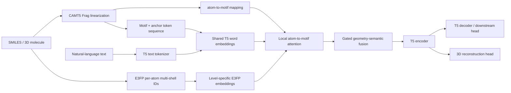

# 03 模型架构与训练数据流

## 1. 研究目标

MoSt-T5 试图学习一个统一的分子多模态生成模型，使同一 T5 框架能够处理：

- 分子 motif 序列重建。
- 原子级三维局部环境重建。
- 分子到文本描述。
- 文本到分子生成。
- 通用文本去噪。
- 下游分子性质分类与回归。

核心思想不是简单把 SMILES 当普通文本，而是建立如下三层表示：

1. motif/拓扑序列：描述分子由哪些子结构及连接锚点组成。
2. 原子级多 shell E3FP：描述每个原子的局部三维环境。
3. 自然语言：描述分子功能、性质或任务指令。

## 2. 总体数据流



## 3. Motif 表示

`model/CAMT5/representation.py` 负责把 SMILES 拆解为带连接锚点的 fragment 序列；`MotifTokenizer` 再把它转换为 token ID。

序列包含：

- `<bom>` / `<eom>`：分子边界。
- `[.]`：多组分分隔。
- `<n*>`：拓扑连接锚点。
- `[motif]`：化学子结构实体。
- `<unk>`：不在词表中的 motif。

`orig_to_new_map` 记录原始 motif 在加入 anchor 后的真实 token 位置，后续 atom mapping 通过它对齐到 encoder 序列位置。

设计价值：

- motif 比字符级 SMILES 更接近化学子结构。
- anchor 显式保存拓扑连接信息。
- atom-to-motif map 能把原子级 3D 信息局部注入对应 motif，而不是对整个分子全局平均。

## 4. E3FP 表示

`E3FPTokenizer` 为每个原子产生多个 shell 层级的折叠 bit ID：

```text
[num_atoms, num_levels]
```

当前配置通常为：

- `e3fp_vocab_size = 4096`
- `e3fp_num_levels = 4`
- padding ID = `-1`

模型内部把 ID 加一，因此：

- `-1` 映射到 embedding 0，作为 padding。
- 有效 bit 0–4095 映射到 1–4096。

每个 shell 层级使用独立 embedding table，随后对四层 embedding 求和。这样保留了“同一 bit 在不同 shell 具有不同参数”的能力。

在线 fallback 会使用 RDKit 生成构象、MMFF 优化，再计算 E3FP；大规模训练则优先读取 LMDB 中预计算的 E3FP。

## 5. 局部 1D/3D 融合

`GeoSemanticFusion` 的核心过程：

1. motif embedding 作为 Query。
2. 原子 E3FP embedding 作为 Key/Value。
3. 只允许 motif 关注 `atom_to_motif_map` 指向自己的原子。
4. 对没有原子映射的文本、anchor、padding token 使用安全空连接处理。
5. 得到 pooled 3D 表示后通过 MLP projector。
6. 根据 motif 和 3D 表示计算 sigmoid gate。
7. 输出 `(1-gate)*motif + gate*projected_3d`。

优点：

- 融合具有局部化化学含义。
- 文本 token 或无 3D token 的 gate 被强制清零，因此退化为普通 T5 embedding。
- 比简单拼接或全分子平均更有表达力。

需要验证的部分：

- 融合前后缺少显式 LayerNorm，训练稳定性依赖 T5 后续层。
- 3D projector 与 gate 是否真正利用 3D，而不是长期接近零。
- atom mapping 覆盖率和错误率。

## 6. Phase 1：motif 与 3D 对齐

### 6.1 输入

- PubChemQC LMDB。
- 20K motif 词表。
- motif IDs。
- 每原子四层 E3FP IDs。
- atom-to-motif mapping。

### 6.2 掩码策略

Phase 1 使用“非坍缩 T5 mask”：

- 输入序列长度保持不变，避免删除 token 后 atom mapping 位移。
- 被 mask 的 motif 逐 token 替换成独立 `<extra_id_n>`。
- decoder labels 依次为 sentinel + 原 token。
- motif 被 mask 时，对应原子的 E3FP 同时被清空。
- 另抽一组纯 3D mask：motif 保留，但对应 E3FP 清空，迫使模型从 1D 推断 3D。

mask 采样不是完全均匀：motif 权重取 fragment size 的 `log1p`，较大 motif 更容易被 mask。

训练时还随机失活外层 E3FP shell，增强对缺失或噪声 3D 的鲁棒性。

### 6.3 损失

```text
L_total = L_T5_reconstruction + lambda_3d * L_3D
```

远端 Phase 1 中：

- `lambda_3d = 500`
- `L_3D` 为 masked motif 位置的 MSE。
- target 是使用未 mask E3FP 计算的局部 pooled 3D 表示，并 `detach`。
- predictor 是 encoder hidden state 经过 `geometric_head`。

这是自蒸馏式几何重建目标：目标不是原始坐标或固定物理量，而是当前 E3FP/fusion 网络生成的 latent representation。

### 6.4 超参数

远端运行配置：

- 自动检测 GPU 数量。
- 每 GPU batch 64。
- gradient accumulation 4。
- 100,000 optimizer steps。
- learning rate `5e-4`。
- warmup 10,000。
- cosine schedule。
- BF16、TF32。
- 每 5,000 steps 保存，最多保留 5 个 checkpoint。

若历史训练使用 8 GPU，则有效全局 batch 为 2,048，约产生 2.048 亿次样本呈现。

## 7. Phase 2：跨模态多任务

### 7.1 任务

| 任务 | 输入 | 输出 | 3D 输入 |
|---|---|---|---|
| MMM | `[MMM]:` + 文本 + motif | 被 mask 的文本/motif token | 有，且局部 mask |
| Caption | 指令 + motif | 分子文本描述 | 有 |
| Text2Mol | `[Text2Mol]:` + 描述 | motif 序列 | 无 |
| Denoise | `[Denoise]:` + C4 文本 | 被 mask 文本 | 无 |

远端 `dataset2.py` 实际通过 `np.random.choice` 做四任务 25% 等概率抽样。虽然构造函数接收 `task_probs`，该远端版本实际忽略该参数。

### 7.2 扩词表

- Phase 1 config vocabulary：52,306。
- Phase 2 config vocabulary：57,306。
- 新增约 5,000 个 motif。
- 代码硬编码 `REAL_OLD_VOCAB_SIZE = 52306`。
- 新 motif embedding 尝试通过 Morgan 指纹相似度继承最相似旧 motif 的 embedding。

这个策略本身有化学动机：新 motif 不从纯随机向量开始，而从结构相似的旧 motif 初始化。但它要求旧词表 ID 与新词表前 52,306 个 ID 完全一致；当前实现没有满足这一前提的可靠保证。

### 7.3 超参数

远端运行配置：

- 固定 `NUM_GPUS=8`。
- 每 GPU batch 4。
- gradient accumulation 32。
- 有效全局 batch 1,024。
- 30,000 optimizer steps。
- learning rate `2e-4`。
- warmup 3,000。
- weight decay 0.05。
- `lambda_3d = 1.0`。
- 每 3,000 steps 保存，最多保留 3 个 checkpoint。

脚本注释称“单卡调试版”，但实际固定为八卡；并重复传入一次 `--optim adamw_torch_fused`。注释与行为不一致，应修正。

## 8. 下游任务

### 8.1 判别式性质预测

典型流程：

1. 用 MoSt-T5 encoder 编码 motif + 3D。
2. 对 encoder hidden state 做 masked mean pooling。
3. 接 MLP 分类或回归头。
4. 可使用全量微调、LoRA 或冻结 encoder。

数据包括 BBBP、BACE、ClinTox、SIDER、Tox21、ToxCast、HIV、MUV、ESOL、FreeSolv、Lipophilicity 等。

可靠评估应优先使用 scaffold split，并报告多 seed 均值和标准差。

### 8.2 生成式性质预测

把性质问题写成文本 prompt，让 decoder 生成数值字符串，再用正则提取 float 并计算 MAE。

优点是统一任务形式；缺点是：

- 生成格式失败会造成有效率下降。
- 数值 tokenization 和精度控制会影响 MAE。
- 必须同时报告解析成功率，不能只报告成功样本 MAE。

### 8.3 Mol2Text / Text2Mol

- Mol2Text：motif + 3D 到自然语言描述。
- Text2Mol：自然语言到 motif，再解码为 SMILES。

Text2Mol 需要报告至少：

- validity。
- uniqueness。
- exact match / canonical match。
- fingerprint similarity。
- scaffold similarity。
- property distribution consistency。

## 9. 当前架构的合理性判断

合理且值得保留的部分：

- motif 与原子级 E3FP 的显式局部对齐。
- 文本 token 在无 3D 时能自然退化为普通 T5。
- Phase 1 先学结构对齐，Phase 2 再学跨模态生成的课程式设计。
- C4 denoise 用于缓解语言能力遗忘。
- vocabulary coverage 与下游任务覆盖率有独立分析工具。

需要实验证明的部分：

- E3FP 融合是否优于仅 motif、仅 SMILES 或 2D graph baseline。
- latent 3D reconstruction 是否学到几何信息，而不只是拟合自身移动目标。
- 25% 等权任务是否合理。
- 扩词表智能初始化是否比固定词表、随机初始化或 tokenizer retrain 更好。
- 生成式性质预测是否比判别头更稳定、更有迁移价值。
