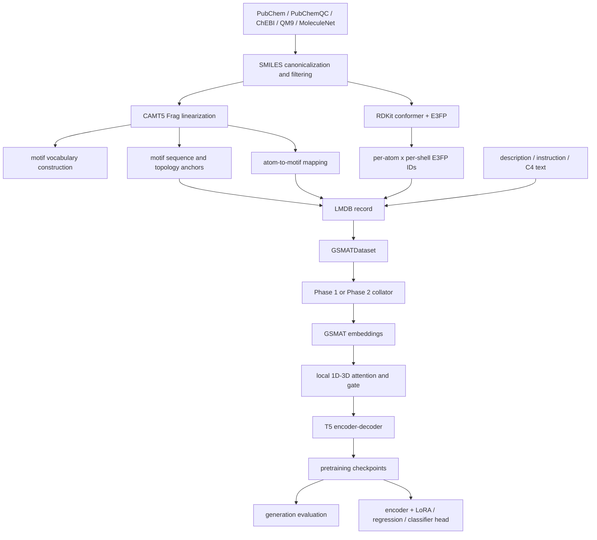

# 07 代码整体思路与实现分析

## 1. 一句话概括

MoSt-T5 的核心不是把三维坐标直接输入 T5，而是先把分子转换成可生成的 motif 拓扑语言，再把每个原子的多层 E3FP 三维指纹通过 atom-to-motif 映射，局部注入对应 motif token；最后使用同一个 T5 编解码器统一完成结构重建、分子描述、文本生分子、文本去噪和性质预测。

可以写成：

```text
MoSt-T5 = T5 backbone
        + motif topology language
        + atom-level multi-shell E3FP
        + local atom-to-motif fusion
        + geometry reconstruction objective
        + cross-modal multi-task training
```

## 2. 项目想解决的问题

普通 SMILES-T5 有三个限制：

1. 字符或子词不一定对应稳定的化学功能单元。
2. SMILES 主要表示二维拓扑，缺少构象相关的局部三维环境。
3. 文本、分子生成和性质预测通常由不同模型或任务头分别完成。

代码尝试通过三种信息互补解决：

| 信息 | 表示 | 解决的问题 |
|---|---|---|
| 化学子结构 | motif + anchor token | 让序列 token 更接近化学基团和连接关系 |
| 局部三维环境 | 每原子多 shell E3FP | 为同一 motif 补充构象和邻域信息 |
| 自然语言语义 | T5 text token | 连接描述、生成指令和通用语言知识 |

最终研究假设是：局部对齐的 motif+3D 表示应比 SMILES-only、motif-only 或全局指纹拼接更适合跨模态生成和结构敏感性质预测。

## 3. 完整代码流水线



代码实现可分为五层：数据准备、tokenization、batch 构造、模型、训练与评估。

## 4. 数据准备层

### 4.1 Phase 1 数据

主要处理链：

```text
pubchemqc_database.lmdb
  -> process_qc_step1_e3fp.py
  -> pubchemqc_e3fp.lmdb
  -> process_qc_step2_mapping.py
  -> pubchemqc_final.lmdb
```

第一步读取分子并计算 E3FP，把结果写入 record 的 `e3fp` 字段。第二步调用 CAMT5 `linearize`，把 `atom_mapping` 加入 record。

最终训练记录至少应包含：

```python
{
    "smiles" or "smiles_kekule": str,
    "e3fp": ndarray[num_atoms, 4],
    "atom_mapping": list[list[int]],
    "description" or "text": str,       # Phase 2/多任务需要
    "cid" or "index": ...               # 过滤、追踪使用
}
```

### 4.2 Phase 2 数据

`build_phase2_ready_lmdb.py` 对 PubChem Phase 2 数据补充：

- Kekulé/规范化 SMILES。
- motif 对应的 atom mapping。
- 四层 E3FP。

另有 `text_weights.py` 从训练文本统计近似 IDF 权重，供文本 mask 时使用。

### 4.3 词表构建

词表工具先从 PubChemQC 等语料统计 motif 频率，建立 Phase 1 20K 词表；再从 PubChem、QM9、ChEBI、反应数据分析 coverage，向 Phase 1 词表追加约 5K motif，得到 Phase 2 25K 词表。

`generate_phase2_vocab.py` 保留基础词表文件顺序，再追加新 token，这个设计本来能够保证旧词表前缀稳定。但 `MotifTokenizer` 随后把文件重新放入 `set`，破坏了这一保证。这是“数据准备设计正确、加载实现抵消设计”的典型偏差。

## 5. Tokenization 层

### 5.1 TextTokenizer

基于 T5 tokenizer，并加入：

- `[MMM]:`
- `[Caption]:`
- `[Text2Mol]:`
- `[Denoise]:`
- `<bom>` / `<eom>` 等多模态符号

这些任务前缀用于 Phase 2 路由和 loss 分任务统计。共享 tokenizer 使自然语言、task token 和 motif token 位于同一个 vocabulary/embedding 空间。

### 5.2 MotifTokenizer

调用 `Frag.encode(smiles)` 生成 motif 字符串，然后：

1. 加入 `<bom>`。
2. 把每个 fragment 的 `<n*>` anchor 放在实体 motif 前。
3. 查 20K/25K motif vocabulary。
4. 未覆盖 motif 写成 `<unk>`。
5. 加入 `<eom>`。
6. 返回 token ID 和 `orig_to_new_map`。

`orig_to_new_map` 很重要，因为一个原始 motif 在加入若干 anchor 后，实际 token 位置会发生变化。Dataset 用该映射把预计算的 atom mapping 转换为 encoder token 位置。

当前最严重的问题也位于这里：motif vocabulary 通过 `set -> list` 注册，token ID 跨进程不稳定。此问题会破坏 embedding 行的化学语义，应先于任何模型优化修复。

### 5.3 E3FPTokenizer

输入 SMILES 时：

1. RDKit 解析分子。
2. 加氢。
3. ETKDG/EmbedMolecule 生成构象。
4. MMFF 做有限步优化。
5. E3FP 计算每个原子每个 shell 的 identifier。
6. identifier 折叠到 4096 bit vocabulary。

输出通常为：

```text
e3fp_ids: LongTensor[num_atoms, 4]
```

`-1` 表示缺失/padding。训练数据优先使用预计算 E3FP，在线生成主要作为 fallback 或下游数据预处理。

## 6. Dataset 与 Collator 层

### 6.1 Dataset 的职责

Dataset 不直接返回最终 T5 batch，而是返回尚未拼接的模态字段：

```python
{
    "task": str,
    "text_input_ids": Tensor[L_text],
    "target_text_ids": Tensor[L_target],
    "motif_input_ids": Tensor[L_motif],
    "e3fp_input_ids": Tensor[N_atom, 4],
    "atom_to_motif_map": Tensor[N_atom]
}
```

它还负责：

- 从 LMDB 懒加载记录。
- 选择 Phase 2 任务。
- 动态分配 text/motif 的长度配额。
- 把原始 motif mapping 转为 token mapping。
- 在数据错误时重试后续样本。

### 6.2 非坍缩 mask

标准 T5 span corruption 会用一个 sentinel 替换连续 span，输入长度可能缩短。这里为了保持 atom-to-motif 位置不变，使用逐 token sentinel：

```text
原输入:   M1 M2 M3 M4
mask后:  M1 <extra_id_0> M3 <extra_id_1>
label:   <extra_id_0> M2 <extra_id_1> M4 <extra_id_2> </s>
```

优点是位置稳定；代价是它偏离 T5 原始预训练分布，需要通过 baseline 判断是否影响语言建模效率。

### 6.3 重要性加权 mask

- motif：按 fragment size 的 `log1p` 加权。
- text：按预计算 IDF 权重加权。
- 特殊 token 权重强制为零。

因此模型更容易 mask 大 motif 和信息量较高的词，而不是均匀随机 mask。

### 6.4 E3FP mask 与 shell dropout

当某 motif 被选为几何 mask 时，其对应原子的所有 E3FP ID 被设置为 `-1`。同时 batch 级随机移除外层 shell：

- 约 15% 样本移除 level 3。
- 约 5% 样本移除 level 2–3。

这是模拟构象/局部环境缺失的增强策略。

## 7. 模型层

### 7.1 GSMATEmbeddings

输入：

```text
input_ids: [B, L]
e3fp_ids:  [B, L_atom_or_aligned, 4]
```

处理：

- `input_ids` 进入 T5 shared word embedding。
- E3FP 的四个 shell 分别进入独立 embedding table。
- 四层 embedding 相加，形成原子 3D embedding。
- padding ID `-1` 先加一映射到 0；embedding 0 被固定为零。

### 7.2 GeoSemanticFusion

对每个 motif token，仅允许关注 mapping 到该 token 的原子：

```text
Q = motif embedding
K,V = atom E3FP embedding
mask = atom_to_motif_map == motif_position
pooled_3d = softmax(QK^T / sqrt(d)) V
```

随后计算：

```text
g = sigmoid(MLP([motif, projected_3d]))
fused = (1-g) * motif + g * projected_3d
```

若一个 token 没有原子映射，`g` 被强制为 0，输出退化为原始 T5 embedding。这样文本 token、anchor 和 padding 不会被虚假的 3D 信息污染。

### 7.3 MoStT5Encoder

MoStT5 不是在 T5 encoder 后拼接 3D，而是替换 encoder 的输入 embedding 流程：

```text
word/E3FP embedding -> local fusion -> original T5 encoder stack
```

decoder 基本沿用 T5，因此可以继续使用条件生成、teacher forcing 和 Hugging Face generation API。

### 7.4 Geometric Head

encoder hidden state 再经过两层 MLP，预测被 mask 位置的 pooled 3D latent target。

当前 target 来自同一个模型的未 mask E3FP 分支，并被 detach。它是移动的自蒸馏目标，而不是固定坐标、距离矩阵或物理标签。

## 8. Phase 1 实现

### 8.1 目标

只训练 MMM，让模型建立 motif 与局部 3D 的对齐基础。

### 8.2 训练信号

```text
L_phase1 = L_motif_denoising + 500 * L_latent_3D_MSE
```

输入中同时存在：

- 1D 与 3D 都被遮蔽的位置。
- 仅 3D 被遮蔽、motif 仍可见的位置。

理论上这使模型同时学习：

- 从上下文恢复 motif。
- 从 motif/上下文推断缺失的局部 3D。
- 在 1D 与 3D 都缺失时利用全局分子结构。

### 8.3 代码实现评价

合理点：

- 训练目标和局部 mapping 设计一致。
- 保持序列长度避免 mapping 错位。
- 记录 language loss 与 geometry loss。

风险点：

- `lambda_3d=500` 很大，但 target 尺度和稳定性没有校准证据。
- target 由当前 fusion 参数生成，可能出现目标漂移或内部捷径。
- 未配置 validation 时只能判断训练完成，不能判断泛化或最佳 step。

## 9. Phase 2 实现

### 9.1 目标

在 Phase 1 结构表示上学习四种任务：

```text
MMM       : text + molecule -> masked text/motif
Caption   : molecule + 3D -> description
Text2Mol  : description -> motif sequence
Denoise   : C4 corrupted text -> original text spans
```

其中 Caption 和 MMM 使用 3D；Text2Mol 和 Denoise 没有 3D 输入。

### 9.2 为什么加入 C4

Phase 2 大量训练化学 token 和短任务文本，可能导致 T5 的通用语言能力遗忘。C4 去噪提供语言锚点，使 shared embedding、encoder 和 decoder 继续接触自然文本。

### 9.3 扩词表智能初始化

代码把 Phase 1 vocabulary size 硬编码为 52,306，扩展到 57,306。对新 motif：

1. 尝试解析为 RDKit molecule。
2. 计算 Morgan fingerprint。
3. 找最相似旧 motif。
4. 复制/继承旧 embedding 作为初始化。

思路合理，但实现成立的前提是 Phase 2 tokenizer 的前 52,306 个 ID 与 Phase 1 完全相同。当前 `set -> list` 使此前提不成立，所以智能初始化可能把“旧 embedding 的化学含义”错配到另一个 token。

### 9.4 多任务 loss 监控

`Phase2MultiTaskTrainer` 根据每个样本第一个 task token，把 token-level cross entropy 汇总成 MMM、caption、text2mol、denoise 四个监控值。实际反向传播仍使用模型返回的总 loss，这些分项主要用于日志。

远端 Phase 2 Dataset 实际强制四任务等概率，传入的 `task_probs` 没有决定路由。这不会改变当前 25% 配置的结果，但会使调参接口失真。

## 10. 下游验证实现

代码中存在两条下游路线。

### 10.1 判别式路线

```text
MoSt-T5 encoder -> masked mean pooling -> MLP classifier/regressor
```

可使用：

- encoder LoRA。
- 全量微调。
- 冻结 encoder 只训练 head。
- 与 MPNN 表示融合。

适合 BBBP、BACE、ClinTox、SIDER、Tox21、ToxCast、ESOL、FreeSolv、Lipophilicity 等。

### 10.2 生成式路线

把性质预测也写成文本生成：

```text
prompt + molecule -> "0.123"
```

生成后用正则解析 float，报告 MAE 和 valid-format ratio。这条路线能验证“统一生成模型”的能力，但必须把格式失败计入结果，不能只计算成功样本。

Text2Mol 也通过 decoder 生成 motif token，再解码 SMILES，并计算 validity 和 fingerprint similarity。

## 11. 设计与代码实现对照

| 设计目标 | 当前实现 | 判断 |
|---|---|---|
| motif 语义稳定 | motif vocabulary 经 `set` 重排 | 未实现，P0 |
| 旧词表可平滑扩展 | 文件层保留前缀，tokenizer 层破坏顺序 | 未实现，P0 |
| 原子局部 3D 注入 | atom-to-motif restricted attention | 实现清晰 |
| 无 3D token 不受污染 | 无连接 token 的 gate=0 | 实现清晰 |
| 结构预训练再跨模态 | Phase 1 -> Phase 2 | 已实现 |
| 语言能力保持 | C4 denoise | 已实现，效果待验证 |
| 多任务比例可配置 | Phase 2 代码硬编码 25% | 接口未真正实现 |
| 最佳模型可选择 | Phase 2 无 validation/best metric | 未实现 |
| checkpoint 可完整复现 | 未保存 tokenizer/mapping/source manifest | 未实现，P0 |
| 下游公平比较 | 多套脚本和输入配置并存 | 尚未统一 |

## 12. 对整体思路的判断

### 值得保留的核心

1. motif 作为分子生成语言，而不是把 SMILES 当普通文本。
2. 使用 atom mapping 做局部三维注入，而不是全局向量粗暴拼接。
3. Phase 1/Phase 2 课程式训练。
4. 生成式和判别式两种下游验证路线。
5. 用 shell dropout、几何 mask 和 C4 去噪增强鲁棒性。

### 当前不能证明的结论

1. 已保存 checkpoint 是否学到稳定 motif 语义。
2. 3D 融合是否真正优于 motif-only。
3. 几何 reconstruction 是否学习真实几何而非移动 latent target。
4. Phase 2 30K 是否是最佳模型。
5. 当前下游结果是否来自统一的数据划分和 tokenizer 配置。

### 最优先改进

1. 固定 vocabulary 文件顺序并保存 tokenizer/mapping hash。
2. 用跨进程/DDP 单元测试验证 ID 完全一致。
3. 建立固定 validation 和 checkpoint manifest。
4. 做 motif-only 与 motif+local-3D 的最小消融。
5. 统计 atom mapping coverage、E3FP failure、gate 分布。
6. 再比较不同 3D target 和 `lambda_3d`。

## 13. 最终结论

代码的研究主线是连贯的：数据构建、motif/E3FP 表示、局部融合、两阶段训练和下游任务都围绕“统一分子多模态生成模型”展开。真正有价值的创新点是 atom-to-motif 局部三维融合，而不是简单使用 T5 或 E3FP。

当前主要障碍不是模型结构缺乏想法，而是基础 token ID、checkpoint 追踪和验证闭环没有达到能支撑科学结论的程度。修复这些基础问题后，该思路值得用小规模、参数量匹配的消融实验继续验证；在修复前继续大规模训练，难以区分“模型思路无效”和“实现映射错误”。
