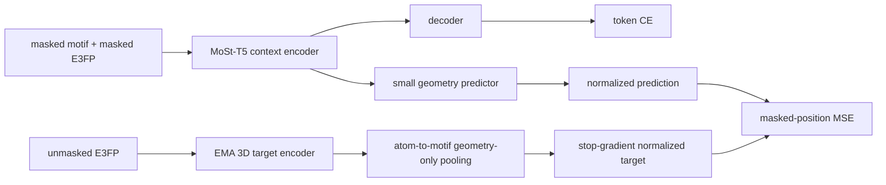

# 12 更优雅的 MSE 融合设计：从附加损失到 3D masked latent prediction

> 路线更新（2026-08-05）：本文件保留 EMA teacher 的专项技术方案，但它不再是 V1 默认主架构。现行裁决先实现 3D-MolT5-style 共享 E3FP embedding 双重均值、单 carrier 固定融合和标准 T5 CE；只有 C1 优于 C0 后才评估 teacher。以 [35_unified_motif_identity_codec_ema_teacher_and_integrated_roadmap_20260805.md](35_unified_motif_identity_codec_ema_teacher_and_integrated_roadmap_20260805.md) 为准。

> 设计日期：2026-07-30  
> 目标：保留 T5 的生成主目标，同时让 MSE 提供稳定、独立、可解释的三维感知监督。

## 1. 核心设计原则

当前方案不应被描述成“在 CE 后面再加一个 MSE”，而应重构为两个职责清晰的学习目标：

- **CE：离散化学身份和生成语法目标**，回答被遮蔽的 motif/text token 是什么；
- **MSE：连续三维感知表示目标**，回答可见二维身份和分子上下文对应什么局部 3D-aware latent。

最理想的关系是互补而非重复：

\[
L=L_{CE}+\lambda(t)L_{geo}.
\]

其中 `L_geo` 不再拟合同一在线网络随时变化、又受 motif query 影响的 target，而是预测一个稳定的、仅由未遮蔽 E3FP view 产生的 motif-level target。

## 2. 推荐架构：EMA 3D teacher + normalized latent MSE



### 2.1 Context/student 分支

输入仍是当前的 masked motif 和 masked E3FP：

\[
h_m = \operatorname{T5Encoder}(x_{motif}^{mask},x_{E3FP}^{mask})_m.
\]

使用小型 predictor，而不是让 encoder hidden 直接拟合 target：

\[
\hat z_m=P(\operatorname{LN}(h_m)).
\]

predictor 建议为：

```text
LayerNorm -> Linear(d, 2d) -> GELU -> Linear(2d, d_target)
```

它能吸收 CE 表示空间和几何 target 空间的坐标差异，降低 MSE 对 T5 主干的刚性约束。

### 2.2 Target/teacher 分支

target 只读取**未遮蔽 E3FP**，不读取真实 motif token，也不使用 sentinel/motif embedding 作为 attention query：

\[
e_a^{T}=E_{EMA}(d_{a,0},\ldots,d_{a,L}).
\]

再按 atom-to-motif mapping 聚合：

\[
z_m^{T}=\operatorname{Pool}\{e_a^{T}:a\in m\}.
\]

首版优先使用 mean pooling + LayerNorm；它比当前 motif-query attention 更容易解释，并避免 target 因 motif 被遮蔽与否而发生定义变化。后续可以比较：

- mean pooling；
- level-aware mean；
- 使用固定可学习 `[GEO]` query 的 attention；
- 当前 motif-conditioned attention。

teacher 参数不接收梯度，而以 EMA 更新：

\[
\theta_T\leftarrow \tau\theta_T+(1-\tau)\theta_S.
\]

初始可测试 `τ=0.99/0.995/0.999`。具体数值仍需消融，但 EMA target 比 same-step `detach` 更稳定，也与 C-FREE/BYOL/JEPA 类方法的基本做法一致。

### 2.3 归一化后的 MSE

先归一化，再计算距离：

\[
\bar z=\frac{z}{\|z\|_2+\epsilon},\qquad
L_{geo}=\frac{1}{|M|}\sum_{m\in M}\|\bar{\hat z}_m-\operatorname{sg}(\bar z_m^T)\|_2^2.
\]

归一化 MSE 等价于一个缩放后的 cosine distance，可减少通过整体缩小 latent 范数降低 loss 的平凡路径。仍需监测每维方差和有效秩；归一化不能单独保证不塌缩。

## 3. 重新划分 mask 的职责

当前 collator 内部已经生成：

- `mlm_mask_pos`：motif 身份和对应 E3FP 同时遮蔽；
- `geo_mask_pos`：包含上述位置以及额外的 E3FP-only 遮蔽位置。

但返回时只保留了合并后的 `geo_mask_pos`。建议显式返回：

```text
joint_mask_positions = mlm_mask_pos
geo_only_mask_positions = geo_mask_pos & ~mlm_mask_pos
```

### 推荐的第一阶段职责

```text
CE  : joint_mask_positions
MSE : geo_only_mask_positions
```

这样：

- CE 学习缺失 motif 的离散身份；
- MSE 在 motif 身份仍可见时学习缺失三维状态；
- 不要求模型从“身份和几何同时完全缺失”的位置回归一个可能高度多解的构象 latent；
- 两个目标更互补，梯度冲突通常更容易控制。

验证稳定后，可增加一个较弱的联合遮蔽几何项：

\[
L_{geo}=L_{geo-only}+\beta L_{joint},\quad 0\le\beta<1.
\]

`β` 必须实验选择；第一版建议先设为 0，从最清晰的目标开始。

## 4. 让 MSE 不压制 T5 的四层保护

### 4.1 时间保护：warm-up 和渐进开启

不要从 step 0 直接施加大权重：

```text
0% - 5% steps   : lambda = 0，只建立 motif/CE 基线
5% - 20% steps  : lambda 线性或 cosine ramp
20% - 100%      : 按梯度比例稳定调整
```

实际比例可变，但原则是先让新增 token、fusion 和 CE 进入可用尺度，再要求 encoder 拟合几何 target。

### 4.2 尺度保护：按梯度而不是 loss 数值定权

定义共享参数上的梯度比例：

\[
r=\frac{\lambda\|g_{geo}\|}{\|g_{CE}\|+\epsilon}.
\]

首轮可把目标比例控制在 `r≈0.1-0.3`，表示几何监督是辅助项；这不是最终最优值，只是比直接指定 500 更可解释的安全起点。

可以每 50-100 step 采样一次梯度范数，并更新：

\[
\lambda_{new}=\operatorname{clip}\left(
\rho\frac{EMA(\|g_{CE}\|)}{EMA(\|g_{geo}\|)+\epsilon},
\lambda_{min},\lambda_{max}
\right).
\]

其中 `ρ` 是希望的辅助梯度比例。若不希望一开始实现动态权重，至少应先跑 `λ=0/1/10/100/500` 的短实验，选取使 `r` 合理的权重。

### 4.3 方向保护：监测或处理梯度冲突

记录：

\[
c=\cos(g_{CE},g_{geo}).
\]

- `c>0`：两个目标协同；
- `c≈0`：互相干扰较弱；
- `c<0` 且持续：降低 `λ`，或对共享参数使用 PCGrad；
- 只在个别层冲突：优先限制 MSE 作用层，而不是全局处理。

### 4.4 参数保护：先让 MSE 作用于新增模块

推荐渐进范围：

1. 几何 predictor；
2. fusion 和 E3FP embedding；
3. encoder 顶部少量层或专用 geometry adapter；
4. 最后才考虑全部 T5 encoder。

decoder 不需要直接接收 MSE 梯度。若新增 geometry adapter，CE 仍可训练整个生成路径，而 MSE 主要塑造几何支路和 encoder 高层，能减少对原始语言知识的扰动。

## 5. 当前代码需要调整的关键点

### 数据层 `dataset/dataset.py`

1. `_apply_non_collapsing_t5_mask` 同时返回 `mlm_mask_pos` 和 `geo_only_mask_pos`。
2. batch 增加：

```text
joint_mask_positions
geo_only_mask_positions
valid_3d_sample_mask
```

3. 对 E3FP 全 `-1`、构象失败或 mapping 为空的样本，不计算 MSE。
4. shell dropout 只作用 student/context view，teacher 始终读取完整 E3FP。

### 模型层 `model/modeling.py`

1. 新增 `ema_geo_encoder`，初始化为 student E3FP encoder 的复制。
2. target pooling 不再调用带 motif query 的 `compute_pooled_3d`；新增 geometry-only pooling。
3. target 分支必须：

```text
eval mode + no_grad + stop-gradient + EMA update
```

4. predictor 和 target 均做 LayerNorm/L2 normalization。
5. MSE 首先只使用 `geo_only_mask_positions`。
6. 不再使用 `torch.nan_to_num` 静默把异常变为 0；应统计并跳过无效位置，若异常比例超过阈值则中止训练。
7. 输出 `raw_geo_loss`、`weighted_geo_loss`、有效位置数、latent 方差和范数。

### 训练层 `train1.py`

1. 删除硬编码 `lambda_3d=500`，改成配置项和 schedule。
2. 增加 CE/geo 梯度范数和 cosine 采样日志。
3. 每次 optimizer step 后更新 EMA teacher，不在 gradient accumulation 的每个 micro-batch 更新。
4. 保存和恢复 teacher、schedule、EMA step；否则断点续训 target 会跳变。

## 6. DDP 下的正确归一化

当前每个 rank 对本地有效位置做 `mean`，随后 DDP 再平均各 rank 梯度。当各 rank 有效 mask 数不同，这相当于“每个 rank 等权”，不是“每个有效位置等权”。

更严谨的做法：

1. 每个 rank 计算本地平方误差和 `local_sum`；
2. all-reduce 得到全局有效元素数 `global_count`；
3. 使用与 DDP 梯度平均相匹配的缩放：

\[
L_{geo}^{rank}=\frac{world\_size\cdot local\_sum}{global\_count}.
\]

这样 DDP 平均各 rank 梯度后，等价于全局所有有效位置的真正均值。空 mask rank 仍返回与计算图相连的零 loss。

## 7. 推荐的分阶段实现

### V1：最小安全改造

- 拆分 joint 与 geo-only mask；
- MSE 只作用 geo-only；
- prediction/target L2 normalization；
- `lambda` warm-up；
- 记录梯度范数和 cosine；
- 保留当前 detach target 作为对照。

目的：低成本判断“职责拆分 + 权重控制”能否避免 CE 受损。

### V2：推荐论文方案

- 增加 EMA 3D teacher；
- 使用 geometry-only mean/level-aware pooling；
- teacher 不读取 motif token；
- 正确处理 DDP global mean；
- 保存 teacher checkpoint 状态。

这时可以把方法清楚表述为：

> masked 2D/3D context-to-geometry latent prediction with an EMA target encoder。

### V3：增强版本

- 多构象 target 或构象采样；
- geometry adapter/只更新 encoder 高层；
- PCGrad/GradNorm；
- variance/covariance regularization；
- 与距离、角度、E3FP-ID 分类目标联合对照。

V3 应在 V2 已证明有效后再做，避免一次引入太多无法归因的机制。

## 8. 最小对照实验

| 编号 | 配置 | 用途 |
|---|---|---|
| A | E3FP input + CE | 必须保留的强基线 |
| B | A + 当前 same-network MSE | 测当前实现 |
| C | A + geo-only normalized MSE + warm-up | 测职责拆分与稳定尺度 |
| D | C + EMA teacher | 测稳定 target 的贡献 |
| E | D + geometry-only pooling | 测去除 motif-query 污染的贡献 |

所有实验保持相同数据、初始化、训练 token 数和评测协议。至少运行多个 seed，并同时观察：

- validation CE 与生成指标；
- 3D-sensitive 下游指标；
- target/pred latent 方差和有效秩；
- gate 分布；
- CE/geo 梯度范数和 cosine。

## 9. 最终推荐公式

首选版本：

\[
\begin{aligned}
h_m &= f_{T5}(x_{motif}^{mask},x_{E3FP}^{mask})_m,\\
\hat z_m &= \operatorname{norm}(P(\operatorname{LN}(h_m))),\\
z_m^T &= \operatorname{norm}(\operatorname{Pool}(E_{EMA}(x_{E3FP}^{full}))_m),\\
L_{geo} &= \frac{1}{|M_{geo-only}|}\sum_{m\in M_{geo-only}}
\|\hat z_m-\operatorname{sg}(z_m^T)\|_2^2,\\
L &= L_{CE}+\lambda(t)L_{geo}.
\end{aligned}
\]

这个版本的逻辑边界最清楚：

- CE 学身份和生成；
- MSE 学三维感知 latent；
- teacher 提供稳定 target；
- predictor 负责空间映射；
- normalization 防止尺度捷径；
- schedule/gradient ratio 保护 T5；
- geo-only mask 降低目标歧义。

## 10. 判断是否“融洽”的标准

只有同时满足以下条件，才能认为 MSE 与 T5 融合成功：

1. CE-only 与 CE+MSE 的验证生成能力没有超过随机波动范围的退化；
2. 至少一个预先指定的 3D-sensitive 指标稳定提升；
3. latent 方差和有效秩没有塌缩；
4. gate 没有普遍退化为关闭 3D；
5. `λ||ggeo||/||gCE||` 位于预设辅助范围；
6. 梯度长期冲突得到控制；
7. EMA teacher、mask 和 checkpoint 在多卡与断点续训下可复现。

如果 D/E 没有超过 A，则最优雅的选择是删除 MSE、保留 E3FP 输入和 CE，而不是为辅助目标继续堆叠机制。
