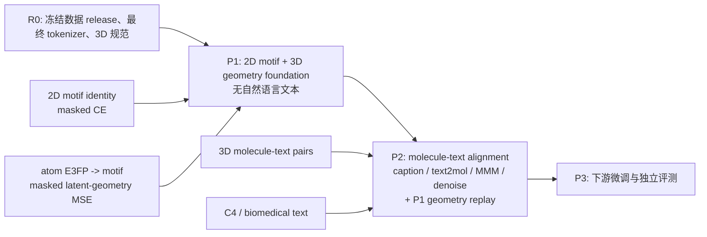

# 18 Phase-1 重构决策：结构基础预训练、数据谱系与固定词表

> 决策日期：2026-07-30  
> 状态：架构方向已确定；PCQM4Mv2 是否成为正式主语料，取决于数据映射、去泄漏与词表门的验收。  
> 不覆盖原始 LMDB、旧 checkpoint 或 3D-MoIT 数据；新方案只创建新的、可追溯的 release。

## 1. 结论先行

原有的**分阶段思想应保留并强化**，但必须重构数据与 token 的生命周期：

1. **Phase 1（P1）**只学习分子语法与 2D--3D 结构关联，不宣称使用文本。
2. **Phase 2（P2）**才引入分子--文本对齐、文本到分子、分子到文本和语言去噪；同时保留一条 P1 几何 replay，防止结构能力被语言任务遗忘。
3. **词表必须在 P1 开始前一次性固定**，P2 禁止重新排列或扩容已有 token ID。
4. PCQM4Mv2 是高度合适、且有 3D-MolT5 直接先例的 P1 候选；但它不是对当前 3D-MoIT/PubChemQC 语料的无条件“升级替换”。只有在 SDF--SMILES--motif 原子映射和全部下游去泄漏通过后，才可以成为正式主线。
5. 现有 P1 checkpoint 不进入新主线：历史 tokenizer 不可恢复，P1 正式 LMDB 路径缺失，且当前 P2 初始化会丢失旧词表权重。

推荐的研究主张不是“用更多数据重新训练”，而是：

> 先在可追溯的 DFT 结构数据上获得稳定的 motif-level 2D--3D 表示，再在严格身份去重的分子--文本语料上对齐；整个生命周期保持同一 token-ID 语义。

## 2. 框架图应如何调整

用户的原图中 `(a)--(c)` 是合理的 P1 核心：2D motif 身份与原子 E3FP 状态，通过 atom-to-motif map 融合后进行双视角掩码建模。

应将图中的训练过程拆成三层，而非让 `(c)` 直接跳到 downstream：



对应的叙述必须精确：

- P1 的“语法”指**分子/motif 语法**，不是自然语言语义；P1 可以没有文本。
- 当前代码中的 MSE 只在 MMM 且有有效 `mask_positions` 时计算，target 是未遮蔽 E3FP 融合表示构造的 latent target，不是原子坐标回归，也不是全部 P2 任务的 E3FP Loss。
- Caption 虽可接收 3D 输入，但当前没有 MSE；Text2Mol 和 Denoise 没有 3D 输入。因此 P2 必须记录每个任务实际的有效几何监督比例。
- 可新增 `3D-only -> motif`（或 `3D-only -> SELFIES`）作为**消融任务**，直接检验 3D 是否能恢复分子语法；它不能被写成已由当前 MSE 自动实现的能力。

## 3. 已知数据谱系与数字：不可混用

### 3.1 用户确认的来源

当前数据来自 3D-MoLM 所发布的 3D-MoIT 数据及其后续 3D-MolT5 风格处理。3D-MoLM 的 3D-MoIT 表中，PubChemQC 的分子级 split 是：

| PubChemQC split | 唯一分子数 | 备注 |
|---|---:|---|
| pretrain | **3,119,717** | P1 应使用的分子身份集合 |
| train | 623,944 | 不能混入 P1 pretrain |
| valid | 77,993 | 不能混入 P1 pretrain |
| test | 77,993 | 不能混入 P1 pretrain |
| 论文表中总计 | 3,899,647 | 同一分子可展开为多条性质 QA |

`3,119,717` 是**唯一分子/输入 ID**数量；不要把它与 12,478,868 条 computed-property QA 行混淆。P1 的 masked motif/3D 预训练应以每个合格分子结构为样本，而非把同一结构按多个性质 prompt 重复计入结构语料。

P2 的 3D-MoLM PubChem molecule--text pretrain 对在论文中是 301,658 条；当前 materialized Phase-2 LMDB 是 301,655 条。P0 对 recovery P1 候选读到 3,899,644 条，而论文 split 总数为 3,899,647。两个地方都相差 3 条，不能凭猜测忽略：必须列出每个缺失 ID、原始 record hash、过滤函数与排除理由。

### 3.2 PCQM4Mv2 是另一条来源 release

3D-MolT5 使用 PCQM4Mv2 做 1D+3D joint denoising 和 3D-to-1D translation；其论文的处理后规模是 3,377,055。OGB 官方提供的训练 SDF 有 3,378,606 个带 DFT 平衡构象的分子，且只向 train 提供 3D；验证和测试不提供显式 3D。官方还说明约 46 个训练样本的 SDF 与 SMILES 图不一致，并且不提供 SDF--SMILES 的 atom-to-atom correspondence。

因此，PCQM4Mv2：

- 是 P1 “2D/motif 语法 + 3D 几何”学习的强文献先例；
- **不是**当前 3D-MoIT PubChemQC release 的同义词；
- 不能直接改一个数据路径就接入当前 LMDB/atom mapping 代码；
- 可能与 legacy PubChemQC、P2 或下游集有同一分子身份，必须先去重；
- 不应使用其 HOMO--LUMO 标签作为 P1 的监督，除非另行把任务定义为性质预训练并进行独立消融。

## 4. 主方案与数据选择的判定

### 4.1 无条件采纳的调整

| 调整 | 决策 | 理由 |
|---|---|---|
| P1→P2 分阶段 | 保留并明确职责 | P1 建立结构基础，P2 做跨模态对齐，科学因果更清楚。 |
| P1 词表 | 在 P1 前构建**最终固定词表** | 解决当前 `set -> list` 导致的 token-ID 漂移；P2 可严格加载 P1。 |
| P2 词表扩容 | 禁止 | P2 不得重新分配或扩容旧 token 行。若以后必须新增，只能 append-only，并逐行验证旧 ID/权重不变；主实验不应依赖此分支。 |
| 旧 P1 checkpoint | 不继承到新主线 | tokenizer 与数据 release 谱系不可证明。 |
| P2 几何保持 | 加 P1 geometry replay 作为可控任务 | 当前多数 P2 路由没有 MSE/3D；需要实验判断文本对齐是否冲淡几何能力。 |

### 4.2 条件采纳：PCQM4Mv2-P1

**推荐将 PCQM4Mv2 建成新的 P1 主线候选，同时将重建后的 3D-MoIT PubChemQC pretrain 保留为受控基线和回退方案。**

选择 PCQM4Mv2 为正式 P1 的前提是：

1. OGB archive、版本、train split 和 SDF hash 已冻结；
2. 从同一重编号 SDF Mol 同时产生 canonical SMILES、坐标、E3FP 和 atom-to-motif map；
3. 已处理 SDF/SMILES 图不一致、RDKit 失败、显式 H、E3FP padding 等拒绝样本；
4. PCQM-P1、P2、词表构建语料与每个下游 valid/test 的分子身份交集均为零；
5. P1/P2 是否允许同一分子重叠已预注册。主结果推荐 `P1 ∩ P2 = ∅`，另将有重叠的 continual-pretraining 设为消融；
6. 与重建后的 legacy 3,119,717 P1 在同一 tokenizer、相同 token budget、相同 P2 和相同评测集上比较。

如果任何前置门失败，使用正式的 `legacy_3dmolm_pubchemqc_pretrain_r1`，而不是沿用全量 3,899,644 recovery 或历史 checkpoint。

## 5. 新 release 的最小数据契约

每个 accepted record 至少保存：

```text
source_dataset, source_version, source_record_id/CID, split_role,
raw_smiles, canonical_isomeric_smiles, full_inchikey, connectivity_inchikey,
geometry_atom_order, coordinates_hash, conformer_hash,
e3fp_spec_hash, e3fp, atom_to_motif_map, motif_sequence,
hydrogen_policy, rejection_or_warning_flags
```

推荐原子宇宙政策：以同一个规范化分子对象生成 map、坐标和 E3FP；全图可参与局部环境计算，但 E3FP 的 center row 与 atom-to-motif map 均以 heavy atom 为准。任何 source-explicit-H、同位素 H 或质子必须显式标识，不能静默指向 E3FP padding。

P1 `pretrain` membership 的验收顺序：

1. 流式读取 3D-MoIT instruction JSON，抽取并去重 `input`/CID；
2. 将唯一 ID 与原始分子 LMDB join；
3. 报告 raw task-row、unique ID、found/missing/invalid/rejected；
4. 对 pretrain/train/valid/test 的 ID、canonical SMILES、full InChIKey 做两两交集；
5. 对 `3,119,717` 生成排序 membership hash；
6. 把所有差集和逐条原因写入 reject manifest。

## 6. 最终固定 tokenizer 的规范

词表不是“P1 20k、P2 25k”的两个版本，而是一份新建的最终契约：

```text
scope = P1 structural-train ∪ P2 alignment-train
exclude = P2 held-out ∪ all downstream valid/test
base = frozen T5 SentencePiece vocabulary
added = task tokens + structural delimiters + anchor tokens + motif tokens
ordering = normalized motif frequency descending, Unicode lexical ascending for ties
```

要求：

- 绝不使用 Python `set` 的迭代顺序分配 ID；
- special tokens 只注册一次，并合并保存，避免 MotifTokenizer 覆盖 TextTokenizer 的 metadata；
- 在两个不同 `PYTHONHASHSEED` 进程中构建，`id_to_token` 的 SHA-256 必须完全相同；
- 在 P1 前报告 P1/P2/评测的 motif OOV 和长度截断率；评测 OOV 只能产生 `<unk>`，不得触发扩容；
- 每个 checkpoint 必须复制完整 tokenizer 工件，并保存 `tokenizer_manifest_sha256`、data release、E3FP spec、resolved config、seed 和代码 hash；
- P2 以相同 `vocab_size` 严格加载 P1，不调用 `resize_token_embeddings`。

## 7. 实验上如何证明分阶段设计值得保留

固定最终词表、P2 数据、token budget、优化器、下游 split 和随机种子策略后，最小实验矩阵如下：

| 组 | P1 | P2 | 回答的问题 |
|---|---|---|---|
| M0 | 无 P1 | 对齐任务 | P2 本身的能力下界 |
| M1 | 2D motif CE | 相同 P2 | 分子语法基础是否有效 |
| M2 | 2D + E3FP，`lambda_3d=0` | 相同 P2 | 仅 3D 注入是否有效 |
| M3 | M2 + masked latent-geometry MSE | 相同 P2 | MSE 是否带来独立增益 |
| M4 | M3 + P1 geometry replay | 相同 P2 | P2 是否遗忘 3D 结构能力 |
| M5 | M3/M4 的 joint multi-task 对照 | 同总计算量 | 分阶段是否优于联合训练 |
| D1 | legacy P1 与 PCQM-P1 | 固定其余条件 | 结论来自数据源还是算法 |

先做单 seed 小规模 pilot 排除实现错误，再对主结果至少运行 3 个种子，报告均值、区间、OOV、原子映射失败率、有效 3D MSE token 比例、截断率和 P1/P2 identity overlap。

## 8. 证据与边界

- 3D-MoLM/3D-MoIT 的公开 split 表支撑 3,119,717 个 PubChemQC pretrain 分子和 301,658 个 PubChem pretrain 分子对。[3D-MoLM ICLR 2024](https://openreview.net/pdf?id=xI4yNlkaqh)
- 3D-MolT5 证明 PCQM4Mv2 可用于 1D+3D 联合去噪和 3D→1D，但其表示是原子级 SELFIES--E3FP，损失以 CE 为主；它不直接证明本项目的 motif 聚合或 CE+MSE 必然最优。[3D-MolT5 ICLR 2025](https://proceedings.iclr.cc/paper_files/paper/2025/file/3d4dc72d715bd6415d356293079adf3d-Paper-Conference.pdf)
- PCQM4Mv2 的公开 3D 数据和已知映射限制来自 OGB 官方说明。[OGB PCQM4Mv2](https://ogb.stanford.edu/docs/lsc/pcqm4mv2/)
- 因此“PCQM4Mv2-P1 + 固定词表”是更可审计的候选主线，不能在未完成数据门、去泄漏和可比消融前写成已被文献证明的最优方案。
