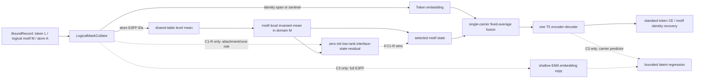

# Motif 身份无损 codec、motif-native 3D 聚合与条件式 EMA teacher 裁决（2026-08-05）

状态：主干完成代码结构、文献先例和审稿逻辑复核。本文件继续作为三域 codec 与条件式 EMA teacher 的设计依据；2026-08-06 起，候选优先级、数据集范围和执行顺序以[文档 41](41_scientific_design_comparison_dataset_and_execution_plan_20260806.md)为准。C1-G/C1-R 已移出当前主比较，teacher 仍只允许条件启用。它不表示已经修改训练代码或放行 P1。

## 0. 主干结论

用户的限定正确：

- `lossless / round-trip` 只用于 **motif 离散身份**；若进一步讨论整分子恢复，还必须包括独立的连接接口；
- E3FP 及其 learned latent 是多对一的 3D-aware 状态，不是无损几何；
- **CE 主线不预设 teacher 或 MSE**：先以标准 T5 CE 分开检验 molecule-global 3D、motif-local 3D 和 interface-conditioned motif 3D；
- 3D-MolT5 式共享 E3FP embedding、level mean 和固定融合只提供原子 3D 输入基线；本项目的 motif 命题必须由 `atom -> logical motif` 局部归约、完整 motif mask、显式接口通道和 motif 分层评测共同建立；
- 只有 motif-local CE 路线已证明有增益后，才测试零初始化、低秩的 interface-state residual；只有选定的 CE 模型通过后，才把浅层 EMA motif-state prediction 作为条件式 C3 候选。

这两条路线能够在当前 T5 主干中科学地统一，但不能通过给现有 token-position 代码增加若干 `if fallback` 完成。最干净的统一点是 `logical_motif_id`：

> identity codec 负责“它是什么”，connection codec 负责“它如何与外部连接”，motif state encoder 负责“把原子 3D-aware 状态在 logical motif 内归约”；可选的 interface-state residual 只建模“接口位置与 3D 状态如何交互”，EMA teacher 只是一项可被实验否决的附加训练假设。

接受的主线候选是：

```text
one T5 backbone
+ logical-motif data contract
+ hybrid identity codec and separate connection interface
+ shared E3FP level mean
+ permutation-invariant atom-to-logical-motif reduction
+ one carrier per logical motif and one fixed fusion
+ standard T5 span CE
+ optional zero-init low-rank interface-state residual after a causal gate
```

接口残差与条件式 C3 都必须逐级放行。接口残差不得读取 motif/token identity、任意 anchor ID、邻居 motif identity 或 DFS/atom 序号；C3 只允许再增加一个浅层 EMA E3FP-state target 和 predictor。不接受第二套 T5 teacher、fallback begin token 充当 QKV 身份 query、多头 attention/gated E3FP fusion、teacher 读取真实 motif/text，或在当前 merged-mask MSE block 上继续叠加条件分支。

## 1. 统一问题定义：一个 motif 的三个关联成分

对第 (i) 个逻辑 motif 定义：

\[
M_i=(I_i,A_i,S_i).
\]

- (I_i=(c_i,p_i))：motif 内部标准化化学子图 (c_i)，以及无 edge-label 的 attachment slot 位置/局部类型 (p_i)。这是 **离散身份**。
- (A_i)：跨 motif edge 的配对、外部连接原子和键型。这是 **组合接口**。
- (S_i)：由给定构象 E3FP 得到、按 motif 原子集合聚合的连续 latent。这是 **不可逆的构象条件状态**。

严格边界：

1. motif 身份无损只要求

   \[
   \operatorname{decode}_I(\operatorname{encode}_I(I_i))=I_i
   \]

   在预声明支持域内成立。

2. 若声称完整二维分子 round-trip，还必须同时证明 (A_i) 的 slot、edge pairing 和键型恢复。
3. (S_i) 不存在无损承诺；只能检验其刚体不变性、构象可分性、稳定性和下游信息量。

这里的 \(I_i,A_i,S_i\) 是三个**显式关联成分**，不是统计独立因子：E3FP 本身同时编码原子身份、拓扑邻域和构象信息，所以 \(S_i\) 必然与 \(I_i,A_i\) 有信息重叠。该表示不是为了增加模块，而是把不同操作语义拆开。主张只写成“E3FP-conditioned / 3D-aware”时不强制 matched ECFP/Morgan；只有要声称增益来自纯3D而非拓扑容量时，才做一次独立归因对照。

## 2. 是否有模型验证过

### 2.1 已有组件证据很强

| 工作 | 已验证的部分 | 与本项目仍不同 |
|---|---|---|
| [Group SELFIES](https://pubs.rsc.org/en/content/articlehtml/2023/dd/d3dd00012e) | common group token 与基本 atom/branch/ring/attachment 语法共存；在 2500 万个分子上做 encode/decode；明确讨论 chirality 支持域 | 不是 T5 的 CAMT5 motif，也没有 E3FP/teacher |
| [CAMT5](https://aclanthology.org/2025.findings-emnlp.1221/) | motif token 可以在 T5 text-to-molecule 中工作并改善结构上下文 | 没有严格 motif OOV codec，未注册 motif 可能继续被 SentencePiece 切分 |
| [FineMolTex, KDD 2025](https://smufang.github.io/paper/KDD25_FineMolTex.pdf) | GNN 原子状态经 permutation-invariant average READOUT 得到 motif 表示，并进行 motif-word 细粒度训练 | 没有 E3FP、attachment-aware pooling 或统一 T5 carrier；证明 atom-to-motif mean 可行，但也说明单纯均值不是本项目独有机制 |
| [Deep Sets, NeurIPS 2017](https://proceedings.neurips.cc/paper/2017/hash/f22e4747da1aa27e363d86d40ff442fe-Abstract.html) | 为无序集合提供共享元素映射与对称聚合的理论框架 | 不证明普通 mean 充分，也不证明 attachment/core 分池有效 |
| [Hierarchical Generation with Structural Motifs, ICML 2020](https://proceedings.mlr.press/v119/jin20a.html) | atom→attachment→motif 的细到粗层次，并在生成中显式解析 attachment | 2D 图生成模型；不验证 E3FP/T5 或本项目的低秩接口残差 |
| [3DLinker, ICML 2022](https://proceedings.mlr.press/v162/huang22g.html) | 3D fragment linking 中联合确定 anchor、linker graph 与三维结构，说明接口位置在 3D 组合任务中是一等变量 | 特定 linker generation，不证明整分子预训练中的 role-aware pooling 必然有效 |
| [3D-MolT5, ICLR 2025](https://proceedings.iclr.cc/paper_files/paper/2025/file/3d4dc72d715bd6415d356293079adf3d-Paper-Conference.pdf) | 各层 atom-centered E3FP embedding 求平均，再与1D token embedding固定平均；所有预训练/下游使用标准 CE，且明确不预测多分量 E3FP token | 原子粒度；没有 motif codec、motif pooling、interface state 或 EMA latent target；它只直接支撑共享 E3FP 输入和简洁融合基线 |
| [data2vec](https://proceedings.mlr.press/v162/baevski22a.html) | masked student 预测 full-input EMA teacher 的归一化 contextual latent；Transformer 跨语言、视觉、语音有效 | 不含化学 codec，也不与 T5 生成 CE 同构训练 |
| [BYOL](https://proceedings.neurips.cc/paper/2020/hash/f3ada80d5c4ee70142b17b8192b2958e-Abstract.html) | EMA target、stop-gradient、student-only predictor 与归一化表示 MSE 可稳定联合工作 | 全局图像视图，不是 masked motif 或分子模型；EMA 本身也不是无条件防塌缩保证 |
| [C-FREE, ICML 2026](https://openreview.net/forum?id=Vbj1jSaqTo) | ICML 官方程序已收录；分子 2D/3D context encoder + predictor 预测 EMA target encoder 的子图 latent，以 MSE 训练 | GNN/3D encoder 和 complementary subgraph，不是序列 T5、E3FP motif；只能支撑条件式 C3，不能凌驾于 3D-MolT5 的简洁输入路线 |
| [M-JEPA, JCIM 2026](https://pubmed.ncbi.nlm.nih.gov/42402875/) | 小分子图上采用 connected-subgraph masking 与 EMA teacher，直接验证分子子图 latent prediction 路线 | 仅 2D 图；验证任务与规模有限，不能证明 E3FP/T5 组合 |
| [Polymer-JEPA, Digital Discovery 2026](https://pubs.rsc.org/it-it/content/articlelanding/2026/dd/d5dd00308c) | full-graph target encoder 后聚合目标子图 latent，再用 L2 预测；直接支撑“先编码原子/节点、再池化 motif target” | 2D 聚合物图而非小分子 3D T5；raw latent norm 漂移也说明本项目必须归一化 target |
| [SPMM, Nature Communications 2024](https://www.nature.com/articles/s41467-024-46440-3) | 分子 Transformer 中生成 CE、性质目标、对比目标与 EMA 相关机制可以共存 | 不预测局部连续 3D latent，不能直接证明本项目的 target 定义 |
| [T5 hidden-state matching, ICLR 2025](https://proceedings.iclr.cc/paper_files/paper/2025/hash/2fb462e23667ad5e6471a4e9af8e4774-Abstract-Conference.html) | 在 T5/Flan-T5 等 encoder-decoder 中把语言建模与 hidden-state matching 并用可行 | 固定蒸馏 teacher，使用 CKA；不是 EMA 3D state |
| [BPE-Dropout](https://aclanthology.org/2020.acl-main.170/) | 高频单元与低层组合单元可在固定词表中使用多种 segmentation 训练，提高组合鲁棒性 | 语言子词而非化学图；只能支持可选 codec regularization，不能证明化学 round-trip |

发表可信度和项目相关性必须分开：3D-MolT5（ICLR 2025）、Deep Sets（NeurIPS 2017）、HierVAE（ICML 2020）、3DLinker（ICML 2022）、data2vec（ICML 2022）、BYOL（NeurIPS 2020）、FineMolTex（KDD 2025）和 SPMM（Nature Communications 2024）都是正式同行评审工作；C-FREE 已进入 ICML 2026 官方程序，M-JEPA 是 JCIM 2026 正式期刊论文，Polymer-JEPA 是 RSC Digital Discovery 2026 正式论文，但后三者都很新、独立复现有限。对本项目而言，3D-MolT5 直接支撑共享 E3FP 输入/融合/CE；FineMolTex 支撑 atom-to-motif 不变池化；Deep Sets 支撑集合不变性；HierVAE、Group SELFIES 和 3DLinker 支撑 interface 是区别于 identity 的结构变量。它们都不证明精确的 interface-state residual，后者仍是本项目假设。data2vec、C-FREE、M-JEPA 是 teacher 的架构级相邻依据；BYOL、Polymer-JEPA、SPMM 只提供组件级支撑。高 venue 不能弥补任务不完全同构。

### 2.2 没有完全同构的公开验证

截至本次检索，没有发现一篇已发表工作同时具有：

1. CAMT5-style motif T5；
2. 高频 motif 单 token + 稀有 motif 可逆化学语法 span；
3. atom-centered E3FP → logical motif 局部聚合；
4. full-E3FP EMA teacher → masked T5 carrier latent prediction；
5. motif identity/state 双掩码和自然语言编辑验证。

因此可以说**组件级可行性有直接先例，精确组合仍是本项目需要验证的方法假设**。不能把不同论文拼接后写成“整体架构已被验证”。

C-FREE 还在附录指出：序列化 SMILES 与被遮挡图子结构之间没有天然连续位置对应，因此跨模态一致 mask 很困难。这一问题与当前项目完全相邻，也从反面支持我们引入 `logical_motif_id`，而不是继续让 token position 充当化学对象 ID。

## 3. 当前代码适配度

### 3.1 可复用的主干

- 单个 T5 encoder/decoder 与共享 token embedding；
- 原子多层 E3FP embedding 的输入形式；
- atom-to-motif 局部融合的研究思想；
- T5 encoder 后的小型 `geometric_head` 作为 predictor 原型；
- R1 sidecar 中 exact motif digest、atom groups 和 full E3FP；
- 分项 loss 日志与现有 DDP/gradient-checkpointing 训练框架。

因此不需要重写 T5，也不需要重新计算 PCQM4Mv2 的 E3FP release。

### 3.2 必须替换而不能继续打补丁的接口

| 当前实现 | 位置 | 为什么与统一架构冲突 |
|---|---|---|
| atom map 的值直接是 token position | `dataset/dataset2.py:223-235` | 只适用于“一 motif = 一 token”；fallback span 会让身份长度改变 3D 对齐语义。 |
| 通过拼接 text 长度的 dummy E3FP/atom map 使轴对齐 | `dataset/dataset2.py:418-434` | token 轴与 atom 轴被人为耦合；逻辑对象变化后容易产生静默越界。 |
| 按 token 而非 logical motif 采样 mask | `dataset/dataset2.py:308-375` | fallback 越长越容易被 mask，且可能只遮一半身份。 |
| motif token embedding 直接作为 atom attention query | `model/modeling.py:109-147` | 高频 macro query 含身份，稀有 `<fallback_begin>` query 全相同，两个分桶执行的不是同一算法。 |
| target 使用同一 online embedding/QKV，只在当前 step `detach` | `model/modeling.py:274-287` | 不是 EMA teacher；target 还读取 masked motif/sentinel query，混入身份语义。 |
| joint 与 geo-only mask 合并后共同计算 MSE | `model/modeling.py:316-325` | 同一 loss 同时包含“身份可见”和“身份不可见”的不同条件分布。 |
| 固定 `lambda_3d`，历史 P1 为 500 | `model/modeling.py:303-345`、`train1.py:118` | 未归一化 latent 的量级补偿，难以解释且容易压制 CE。 |
| forward 内 `nan_to_num` 后继续训练 | `model/modeling.py:309-337` | 隐藏 target/mapping 错误，不能作为科学门禁。 |

结论：当前结构是**概念上相邻、接口上不兼容**。旧实现应原样保留为 `legacy online-MSE baseline`；新候选路径在 `most_t5_next/` 中重构粗粒度模块，不覆盖原代码。

## 4. 统一且最小的架构



实线部分是 motif-local mean 基线；第一个虚线分支是只在 local-vs-global 门禁通过后评估的 motif-native 完整候选，第二个虚线分支是 CE 候选胜出后才评估的 teacher。二者都不是预设必胜组件。

### 4.1 三个索引域

三个域必须显式存在，不能从 tensor shape 或字符串推断：

- token 域 (L)：T5 序列位置；一个 macro motif 为 1 token，一个 fallback motif 为多 token；
- logical motif 域 (M)：每个化学 motif 恰好一个 ID，与表面 token 长度无关；
- atom 域 (A)：E3FP 原子行。

静态 tokenizer-bound record 至少包含：

```text
input_ids[L]
token_to_logical_motif[L]
token_role[L]                        # identity / connection / boundary / text
identity_spans[M]
connection_spans[M]
logical_to_carrier[M]
atom_to_logical_motif[A]
atom_valid_mask[A]
atom_is_attachment[A]                # 由 cross_motif_bonds 确定；C1-R 使用
cross_motif_bonds[E]                 # 两侧 motif/atom incidence 与 bond type
motif_geometry_valid[M]
full_e3fp_ids[A,K]
exact_identity_digest[M]
```

其中 `logical_to_carrier` 是唯一的序列注入点。候选实现不需要额外给每个 motif 增加新 `[CARRIER]` token：高频 motif 可用其 macro token，fallback 可用 begin token，identity mask 后用 sentinel；关键是 E3FP pooling 不读取该 token 的身份 embedding。

### 4.2 Identity codec

```text
known frequent identity  -> one macro token
rare/unseen identity     -> bounded atom/bond/branch/stereo/slot grammar span
```

要求：

- evaluation 编码确定且 canonical；
- 合法身份不得进入普通 `<unk>`；
- fallback span 有明确边界，不能中途截断；
- macro 与强制 fallback 双编码必须 decode 为同一标准化 motif identity；
- attachment slot 位置属于 (I_i)，分子局部 edge-pair label 属于 (A_i)，二者不能再次混合。

首版只使用语料自然产生的 fallback，不加入 `codec dropout`。只有后续发现训练集 fallback 覆盖不足、且 isolated OOV 评测确实失败时，才把强制 fallback exposure 作为一次数据正则对照，而不是主架构模块。

### 4.3 从 3D-MolT5 输入基线到 motif-native 候选

#### 4.3.1 C1-L：motif-local mean 基线

对每个原子先平均有效 E3FP 层，再只在其所属 logical motif 内平均：

\[
e_a^{3D}=\frac{1}{|K_a|}\sum_{\ell\in K_a}E_{3D}(d_{a,\ell}),
\qquad
g_m=\frac{1}{|\mathcal V_m|}\sum_{a\in \mathcal V_m}e_a^{3D},
\]

其中 \(\mathcal V_m\) 是 logical motif \(m\) 中 E3FP 有效的真实原子集合；\(|\mathcal V_m|=0\) 时 `motif_geometry_valid=false` 并跳过几何输入/目标，不能伪造 atom 0。

只在 `logical_to_carrier[m]` 做一次固定平均：

\[
u_{c_m}=\tfrac12 e_{c_m}+\tfrac12 g_m,
\qquad u_j=e_j\;(j\neq c_m).
\]

它保留 3D-MolT5 的共享表、level mean 与固定融合，但计算对象已经从“一个 atom 对齐一个 SELFIES token”变为“可变大小原子集合归约成一个 logical motif state”。其余 fallback token 保留正常 token embedding，不重复注入 E3FP；T5 self-attention 自行整合完整 fallback span。固定 \(1/2\) 先作为基线，不搜索融合权重。

然而，mean 本身已有 FineMolTex 等先例，且不能区分同一组原子状态中“位于跨 motif 接口”与“位于 motif 主体”的角色。因此 C1-L 是必要、强且可解释的基线，不直接作为最终算法创新。

#### 4.3.2 C1-G：验证 motif 局部归属，而不是只验证有 3D 输入

令整分子的 E3FP atom state 均值广播到每个 motif carrier，其他参数、数据、mask 和训练预算与 C1-L 相同。`C0 -> C1-G` 只回答“3D 输入是否有用”；`C1-G -> C1-L` 才回答“atom-to-motif 的局部归属是否有用”。C1-G 只做小规模因果门禁，不进入正式大规模重复。

#### 4.3.3 C1-R：零初始化的 interface-state residual

若 C1-L 在预注册的 3D-sensitive endpoint 上优于 C1-G，再测试一个且仅一个 motif-specific composer。令 \(\mathcal B_m\subseteq\mathcal V_m\) 是 `cross_motif_bonds` 本侧端点去重后的 attachment atom 集合，\(\mathcal C_m=\mathcal V_m\setminus\mathcal B_m\)。先保留纯状态基线 \(g_m\)，再只建模 attachment 与 core 的状态对比：

\[
\bar e_{m,B}=\operatorname{Mean}_{a\in \mathcal B_m}e_a^{3D},\qquad
\bar e_{m,C}=\operatorname{Mean}_{a\in \mathcal C_m}e_a^{3D},
\]

\[
r_m=v_m\,\mathbf 1_{|\mathcal B_m|>0\land|\mathcal C_m|>0}\,
U\,\operatorname{SiLU}\!\left(V(\bar e_{m,B}-\bar e_{m,C})\right),
\qquad
g_m^{\star}=g_m+r_m.
\]

其中 \(v_m\) 是 student geometry input 的可见/有效 mask。取低秩 \(q=32\)，\(V\in\mathbb R^{q\times d}\)、\(U\in\mathbb R^{d\times q}\)，两层都不设 bias，\(V\) 正常小随机初始化、末级 \(U\) 零初始化。因此 step 0 严格退化为 C1-L，新增 \(2qd\)（在 \(d=768\) 时 49,152）个权重，而不是重新引入约数百万参数的 QKV/gate。最终仍只把 \(g_m^{\star}\) 固定平均到同一个 carrier。

这里的职责边界必须保持：`atom_is_attachment` 只表示一个原子是否是跨 motif 接口端点；不输入任意 `anchor_id`、邻居 motif identity、token embedding、DFS/atom 序号、bond type、group count 或方向向量。无 attachment、无 core、E3FP 无效或 state 被 mask 时，\(r_m\) 必须逐位严格为零；不制造 fake atom 或 learned null。该支路不感知 attachment multiplicity、匹配关系或方向，这些仍由独立 connection codec/后续任务处理。它应称为 **interface-conditioned state fusion**，不能包装成完整 attachment-configuration 或 anchor-specific geometry model。

C1-R 只有在改善集中于多原子/有 attachment motif，而不是仅有总体微小提升时，才进入语义控制。正式控制 `C1-Rpseudo` 必须对每个 motif 保留真实的 attachment/core 数量与空组模式，但用固定 record hash 选择等量 pseudo-attachment atoms；网络、rank、初始化、mask 和预算完全相同。只有 `C1-R > C1-L` 且 `C1-R > C1-Rpseudo`，才能把收益归因于真实 interface role；否则删除 C1-R，最终采用 C1-L。还必须报告 \(|\mathcal B_m|>0\land|\mathcal C_m|>0\) 的有效覆盖率。

### 4.4 条件式 C3：若需要 teacher，target 放在哪一层

| 候选 target | 优点 | 问题 | 裁决 |
|---|---|---|---|
| atom-level E3FP latent | 保留细节 | 与 motif 粒度主张不一致，要求 T5 预测可变原子数，成本高 | 拒绝作为主目标 |
| **identity-query-free E3FP-state motif mean latent** | 与 logical motif 一一对应；复用 C1-L 的纯状态定义；teacher 不读 token/text/interface role | E3FP 仍含原子身份与拓扑且是多对一 | **仅 C3 选用** |
| 当前 motif-query fusion latent | 接近历史实现 | query 含真实 motif 或 sentinel，identity/state 泄漏且 target 定义随 mask 改变 | 拒绝 |
| full contextual T5 teacher hidden | 上下文最丰富 | 同时包含语言、身份、连接；需要第二次大 T5 forward，无法解释为 3D state | 拒绝 |

因此若 C3 被放行，teacher 只复制一张共享 E3FP embedding table，并复用 C1-L 的固定 level/motif mean；即使 CE 主模型选择 C1-R，teacher target 也不包含 attachment/core role residual。这样 `S` target 不重复编码可见的 `A` 通道，也不增加 teacher attention/MLP，不复制 T5，不读 token和文本。这里的“state”明确是 E3FP-derived 3D-aware state，而不是纯几何坐标表示。

\[
z_m^T=\operatorname{F.normalize}\left(
\operatorname{Pool}_{a\in m}E_T(d_a^{full})
\right),
\qquad
\theta_T\leftarrow\tau\theta_T+(1-\tau)\theta_S.
\]

teacher 始终 `eval + no_grad + stop-gradient`，并在每个真正的 optimizer update 后更新一次，而不是每个 forward 或 gradient-accumulation microbatch 更新。

### 4.5 条件式 C3 的 predictor 与 loss

从 T5 encoder hidden 的 carrier 位置取回 motif 域：

\[
\hat z_m=\operatorname{F.normalize}\left(
P(\operatorname{LN}(h_{c_m}))
\right),
\]

其中 C3 唯一新增的可训练模块是一个小 predictor：

```text
LayerNorm -> Linear(d,2d) -> GELU -> Linear(2d,d_target)
```

上述 `F.normalize(..., p=2, eps=...)` 指单位 L2 归一化，不是 LayerNorm。因此首选 squared L2 时，\(\|\hat z-z\|_2^2=2-2\cos(\hat z,z)\in[0,4]\)。data2vec 使用“teacher target normalization + Smooth L1”，这是不同配置；只预注册一次“单位 L2 + squared L2”与“无仿射 LayerNorm + Smooth L1”短测，不扩张为损失函数搜索。

\[
L=L_{T5-CE}+\lambda(t)
\frac{1}{|G|}\sum_{m\in G}
\|\hat z_m-\operatorname{sg}(z_m^T)\|_2^2.
\]

`lambda_3d=500` 被删除。只允许一次梯度尺度校准、固定权重和短 warm-up/ramp；不加入 GradNorm、PCGrad、动态多损失权重或常驻 covariance regularizer。C3 若不能在 CE 非劣前提下超过胜出的 CE-only 候选，直接删除 teacher，而不是继续升级损失工程。

### 4.6 mask 职责

CE 主线只需要 identity recovery；C3 放行后才增加与之互斥的 state prediction：

- `identity_recovery_mask`：完整 identity span 被一个 T5 sentinel 替换，但该 motif 的 E3FP mean 仍注入 sentinel carrier；以标准 T5 CE 恢复身份。这是清晰的“3D-aware state/context → identity”任务；
- `state_prediction_mask`：identity/connection 可见，只清除 student E3FP；只在这些 motif 上计算 teacher latent loss。

C3 的最小定义为 **center-row masked motif-state prediction**：只清除目标 motif 所属原子的 E3FP rows。邻接中心的 E3FP shell 是可见上下文，不能再声称“所有目标几何已被彻底移除”。这与 masked contextual prediction 的语义一致，也更接近 3D-MolT5。shell overlap 先做抽样审计；只有发现近乎直接复制 target 的实质捷径，且 halo 不会把小分子大面积清空时，才增加预计算 halo 作为数据腐化对照，而不是主架构要求。

两个 mask 只实现互为反向的跨视图预测：identity mask 保留 E3FP，state mask 保留 identity。connection/edge-pair mask 是后续 anchor 任务，不揉进首版 identity/state objective。

引入 logical motif 域后，可恢复标准 T5 span collapse，不再需要当前“每个 token 一个 sentinel、保持长度不变”的非标准补丁。Collator 在 corruption 后重建动态 `logical_to_carrier` 即可。

### 4.7 CE 是否按 motif 归一化

主干裁定比自动采用 reweighting 更保守：

- mask 采样必须按 logical motif，而不是按 token；
- CE 主线保持标准 T5 token-mean CE，避免一开始改动最大似然目标；
- 同时报告按 logical motif 聚合的 identity CE、macro/fallback 分桶 CE 和每分子负对数似然；
- 只有实测显示长 fallback span 主导共享梯度或使 16k/32k 比较不可解释时，再做一次 `1/span_len` motif-balanced CE 对照。

可变长语言本来就由多个 token 共同贡献 log-likelihood，因此不能仅凭“fallback token 多”断定标准 CE 错误。

## 5. 为什么这不是补丁化架构

它满足五个统一原则：

1. **一个对象中心**：identity、interface、state 全部挂在一个 `logical_motif_id`，而不是互相依赖 tensor 长度。
2. **一个 T5 主干**：CE 主线没有 teacher；条件式 C3 也只复制浅层 E3FP embedding，推理时删除。
3. **每个模块一个职责**：codec 处理可逆身份，connection codec 处理外部接口，motif mean 定义纯 E3FP state，可选低秩残差只处理 interface-state interaction，T5 负责上下文与生成。
4. **标准训练语义优先**：C0/C1-G/C1-L/C1-R 都只有 T5 span CE；masked latent prediction 必须先证明超过胜出的 CE-only E3FP baseline 才能进入最终模型。
5. **旧补丁可删除**：不再需要 token=motif、一行 text 对一行 dummy atom、same-online detach teacher 和 non-collapsing token mask。

候选实现只设三个必需粗粒度边界和一个可整体删除的扩展：

```text
HybridCodec + Binder
BoundDataset + LogicalMaskCollator
AtomE3FPStateEncoder + LogicalMotifFusion
Optional InterfaceStateResidual
```

`InterfaceStateResidual` 是一个可以整体删除、零初始化后退化为 mean 的粗粒度模块，不拆成多个 head。只有 C3 放行后再增加 `EMATarget + StatePredictor` 与 optimizer-step EMA hook；它们不是 CE 主线的预先依赖。

不为每个小函数单独封装。原始 `tokenization/`、`dataset/`、`model/`、`train1.py` 保留为历史基线，新实现只在 `most_t5_next/` 通过显式 imports 复用稳定主干。

## 6. 资源与工程可行性

CE 候选相比当前代码会把四张 level-specific table 改成一张共享 table，并删除 QKV/projector/gate 与 geometric head。C1-R 的无 bias 低秩接口残差在 `d_model=768,q=32` 时增加 49,152 个权重，远小于历史 attention/fusion；若 C3 通过门禁，以当前 T5-base、E3FP 4096 vocabulary 为例：

- EMA E3FP embedding teacher 约 3,146,496 个无梯度参数；FP32 约 12 MiB，BF16 约 6 MiB；
- predictor 约 2.36M trainable 参数；
- teacher `no_grad`，不保存反向激活，也没有 optimizer state；
- 推理时可删除 teacher 和 predictor（若下游不需要 state probe）。

24GB RTX 4090 能承担接口残差和该浅 teacher；但在 C1-L 证明局部 motif 归属前不实现 C1-R，在 CE-only 候选胜出前不为 teacher 消耗实现和训练资源。主资源风险仍是 fallback 造成的序列增长和 attention activation，必须先以 molecule-level P95/P99 长度确定 batch/gradient accumulation。

EMA 需要训练基础设施做四件事：

1. optimizer update 后更新，不在 model `forward` 内更新；
2. DDP 各 rank 的 teacher hash 一致；
3. checkpoint 保存 teacher、EMA update count、momentum 与 lambda schedule；
4. resume 后下一 step target/loss 与未中断运行一致。

## 7. 并入后的整体执行计划

### R1-A：现在完成，无 GPU

1. 冻结四个核心下游及 retrieval 次级任务的 registry、官方 split、版本与 valid/test 保护并集；
2. 从 P1/P2 membership、tokenizer discovery 和频率统计中排除保护集合；
3. 冻结 motif identity (I)、connection (A)、3D state (S) 的字段定义；
4. 升级 bound-record contract，使 token/logical-motif/atom 三域显式存在。

### R1-B：hybrid codec 门禁，无 GPU

1. top-16k/top-32k 只做一次长度/覆盖/参数量裁定；
2. 高低频 identity round-trip、macro/fallback 双编码、stereo 与 slot 位置审计；
3. molecule-level fallback 数量、P50/P95/P99 和超长拒绝率；
4. 用现有 R1 sidecar 构建 128 条 tokenizer-bound golden records，不重算 E3FP。

### P1-S0：CPU/单 batch

1. hybrid codec + CE-only；
2. standard T5 whole-motif span corruption；
3. strict save/load、decode、carrier/mapping tensor assertions；
4. 验证 macro/fallback 不改变 logical motif、atom groups 与 E3FP motif mean；
5. 验证 `atom_is_attachment` 与 `cross_motif_bonds` 一致，atom/anchor ID 重编号不改变 C1-R 输出，无 attachment 时 residual 严格为零。

### P1-S1：微型 GPU

按因果顺序筛选，不把所有候选一次性投入正式训练：

| 条件 | 目的 |
|---|---|
| C0：hybrid motif + CE | identity codec 和 T5 基线 |
| C1-G：C0 + molecule-global E3FP mean 广播，仍只有 CE | 只检验有无 3D 输入；小规模诊断，不作为最终模型 |
| C1-L：C0 + motif-local E3FP mean + 单 carrier 固定平均，仍只有 CE | 检验 motif 局部归属是否比全局 3D 有效；强基线 |
| C1-R：C1-L + zero-init low-rank interface-state residual，仍只有 CE | 完整 motif-native 候选；检验接口/主体角色是否提供额外信息 |
| C1-Rpseudo：C1-R 的真实组大小 + hash 伪角色 | 仅在 C1-R 初筛为正时运行；排除任意二分组/容量效应 |
| C2：C1-L + legacy online raw MSE | 仅在需要解释历史 checkpoint 时做短测，不进入主架构 |
| C3：胜出的 CE-only 模型 + EMA E3FP-state latent prediction | 只有 CE 主线通过后才实现的条件候选 |

数据预算按 [P1 嵌套代理子集与多保真门禁](36_P1_multifidelity_proxy_subset_and_training_gates_20260806.md) 执行：先做 32/256 条 PF-CANARY，再用 `floor(0.01*N_train_permitted)` 的 PF-1 检查 C0/C1-G/C1-L 的 CE/identity recovery 与同一预注册 3D-sensitive endpoint；10% 只用于确认晋级者，不是默认起点或最终证据。C1-L 不优于 C1-G，则不能声称 motif-local 3D 有效，也不实现 C1-R/teacher；C1-L 通过后才短测 C1-R。C1-R 若没有在多原子/有 attachment 桶中产生相符增益则删除；若为正，再运行分组统计、参数和预算均匹配的 C1-Rpseudo。选定 CE-only 模型后才实现 C3；C3 不优于该模型或损害 CE，则 teacher/MSE 从主方法删除。

### P1-S2：最小归因与数据诊断（不进入模型 forward）

只保留能改变论文表述的检查：

- C0 vs C1-G：3D 输入是否有用；C1-G vs C1-L：motif 局部归属是否有用；
- E3FP level-0-only vs all-level：直接复用现有 tensor 的低成本诊断，判断高层 shell 是否贡献额外信息；
- 少量 atom-to-motif / 跨分子 E3FP shuffle：检查模型是否真正使用局部对齐；
- 小样本同一 2D identity 多构象 probe：支持“conformer-sensitive / 3D-aware”表述；
- shell overlap 只做抽样统计，不实现 halo；只有确认出现近直接 target 捷径时才升级；
- matched ECFP/Morgan 只在论文要声称“3D-specific improvement”时跑一个相同接口的输入替换实验，不形成常驻分支。

这些检查复用同一 `atom_state_ids -> logical motif state` 接口或离线脚本。筛选阶段一个 seed；只有会改变核心结论的对照进入正式重复。C1-R 额外按 singleton/no-anchor、单 attachment、多 attachment、motif size 和 macro/fallback 分桶，避免把一般容量增益误称为 motif-specific 收益。

### P1 正式

正式最小集合先保留 `C0` 与 `C1-L`；C1-R 只有通过小规模门禁后才进入正式重复，未胜出就不强行凑第三个模型。C1-G 只需保留足以支持 locality 裁决的短测；若 C1-R 进入论文，C1-Rpseudo 是不可省略的语义控制；C3 同样只有通过门禁才进入正式重复。统一 tokenizer、membership、有效 token/update 和墙钟预算。`C0→C1-L` 识别 motif-local E3FP-aware 输入，`C1-L→C1-R` 发现角色候选增益，`C1-Rpseudo→C1-R` 才识别真实 interface role，胜出模型 `→C3` 识别 EMA target 增量；C2 只做历史短测。

### P2

加入文本对齐与 anchor/interface 学习，但不新建任务专属大编码器：

- identity/text 双向 masked modeling；
- connection/slot 的轻量恢复或 pointer 任务；
- 若 P1 已保留 teacher，它仍只预测 identity-query-free E3FP-derived state；若 C3 被删除，P2 不重新引入 teacher；
- anchor 只有在严格编辑中同时改善连接位置和非编辑区域保持，才进入论文贡献。

### 下游与机制评测

已接受的问题 2–4 正式采用以下排序：

1. **Motif Text-Based Editing**：核心机制任务；FineMolTex-compatible E1 负责比较，受控 anchor/3D-aware E2 负责主结论；
2. **Text-to-Molecule Generation（ChEBI-20，资源允许再 PCDes）**：decoder、fallback 和 CAMT5 对照；
3. **3D Molecule Captioning**：跨模态能力，增加事实正确性/no-3D 对照；
4. **3D-sensitive Property + conformer/torsion/stereo probe**：几何可归因证据；
5. **Retrieval**：次级诊断，只有协议满足时称 zero-shot。

所有任务在 tokenizer freeze 前只准备 registry、identity manifest 和 split 统计，不立即执行全量训练。

## 8. P1 前硬门禁

### Identity/interface

- 支持域内 motif identity round-trip 100%；失败样本进入 reject ledger；
- macro/fallback 强制双编码得到同一 identity digest；
- fallback 无 `<unk>`、边界平衡、不在 span 中截断；
- 若评价整分子 round-trip，slot、edge pairing、bond type 和声明 stereo 同时恢复。

### 三域对齐

- 每个 valid atom 恰映射一个 logical motif；
- CE 主线必须 `motif_count == carrier_count`；只有 C3 才额外要求 `teacher_target_count == state_prediction_count`；
- carrier 唯一，span 不重叠，无静默越界修复；
- 同一 record 的 macro/fallback 表面编码产生数值相同的 E3FP motif mean 与 C1-R residual；若有 C3，teacher target 也必须相同；
- motif 内 atom 重排和任意 anchor ID 重编号不改变聚合结果；每条 cross-motif bond 在两侧各产生一个合法 attachment incidence；dummy anchor 不进入 atom set。

### Mask 与条件式 teacher

- CE 主线的 `identity_recovery_mask` 保留目标 motif E3FP，并以 CE 恢复完整身份 span；
- 若有 C3，`identity_recovery_mask` 与 `state_prediction_mask` 严格互斥；teacher 不读 token tensor；
- 首版不要求 shell-support sidecar 或 halo；抽样 shell-overlap 审计只决定是否需要后续腐化对照；
- 若有 C3，step 0 teacher=student、teacher 无梯度、EMA 每 optimizer step恰更新一次。

### 数值与训练

- 非有限值 fail/ledger，不使用 `nan_to_num` 静默修复；
- DDP loss 按全局有效 motif 数正确归一化；
- 若有 C3，prediction/target 方差、范数和 effective rank 不塌缩；
- strict checkpoint/resume 可复现；
- C1-L 必须在预注册 locality endpoint 优于 C1-G 才能支持 motif-local 3D 主张；C1-R 必须在适用分桶体现一致收益且优于分组统计完全匹配的 C1-Rpseudo；若有 C3，它必须优于胜出的 CE-only 模型，且 CE/生成不越过非劣界限，否则删除。

## 9. 最终方法表述边界

若 C1-L 胜出而 C1-R 未胜出，可使用保守表述：

> We explicitly represent each molecular motif through three linked components: a round-trip-verifiable discrete identity, an explicit connection interface, and a conformer-conditioned E3FP-derived state. Atom-centered E3FP embeddings are reduced within each logical motif and fused once into its sequence carrier, enabling standard T5 span objectives over both macro and compositional motif identities.

只有 C1-R 通过 C1-Rpseudo 语义对照和分桶门禁后，才追加：

> A zero-initialized low-rank residual conditions each motif state on the contrast between its attachment and non-attachment atoms, while remaining invariant to atom order, anchor numbering, and surface serialization.

只有 C3 通过增量门禁后，才追加：

> An optional shallow EMA target supplies motif-level latent supervision for the reverse state-prediction view.

不能使用：

- lossless 3D motif；
- exact geometry reconstruction；
- 首次 motif-level 3D；
- teacher learning 已被同构模型完整验证；
- universal open vocabulary（除非隔离 OOV/fallback 桶已通过）；
- anchor 提取本身就是创新。
