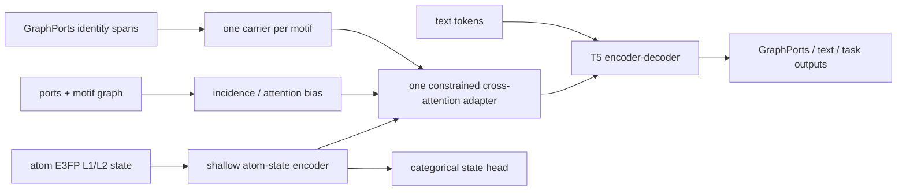

# MoSt-T5 整体架构的文献与方法学裁决（2026-08-08）

## 0. 结论

整体方向具有科研可行性，不需要推翻 E3FP、motif 或 T5；但当前方案不能继续以
“无损 2D 身份 + 与身份解耦的纯 3D 状态”表述，也不能把一次 residual 融合带来的
生成 CE 改善解释成模型理解了对应构象。

建议冻结为：

> 以 GraphPorts 提供权威、可逆的 motif 身份与连接；以 atom-centered E3FP
> 提供 motif 锚定、身份条件化的离散局部 3D 环境状态；以 atom--motif incidence、
> ports 和 motif graph 提供结构 sidecar；由单一轻量 state-memory adapter 将它们
> 接入 T5，并以生成 CE、categorical state CE 和严格配对诊断建立可证伪证据链。

这是**接口与职责因子化**，不是统计上的 identity/state disentanglement。

当前还不应开始 3.36M 全量正式预训练。阻断项不是继续比较许多 fusion，而是：

1. 把正式数据/模型接口从 CE-only residual 更新到 factorized state objective；
2. 修正 E3FP nested-shell 遮蔽语义；
3. 加入最小的 2D-capacity、aligned、shuffled、zeroed 因果对照；
4. 冻结至少一个真正 geometry-sensitive 的外部或预训练排除评估。

## 1. 当前假设的证据等级

| 命题 | 文献与本项目证据 | 裁决 |
|---|---|---|
| motif 是有意义的分子生成单位 | JT-VAE、Hierarchical Molecular Graph Generation、CAMT5、FineMolTex | 有直接或相邻证据，保留 |
| E3FP 可离散表示给定构象 | E3FP 原论文；3D-MolT5 将 E3FP token 接入 T5 | 有直接证据，保留 |
| motif 内 atom-state 可置换不变聚合 | Deep Sets；本项目 G1 level 1/2 结果 | 有理论与机制证据，保留轻量基线 |
| 当前 CAMT5-derived partition 最适合 3D | 无直接证据；不同工作采用 BRICS、RingPath、functional groups | 尚未证明，暂作主划分 |
| identity CE 会自动迫使 T5 使用匹配 E3FP | G2、T3MI、PF-2C 的 shuffle/zero 结果反对该命题 | 已被否定 |
| folded E3FP ID 具有连续几何距离 | 原算法不赋予 bit ID 数值距离；G3a identity-disjoint 泛化失败 | 否定，不做 raw-ID MSE/RMSD metric |
| 单构象 PCQM 可支撑 conformer ensemble | PCQM4Mv2 每个训练分子给一个 equilibrium 3D graph | 不支持 |
| 当前四类下游能证明 3D | editing/retrieval/caption/MoleculeNet 多有强 2D 捷径 | 不足，须加 geometry-sensitive endpoint |

主要一手依据：

- E3FP, J. Med. Chem. 2017: https://doi.org/10.1021/acs.jmedchem.7b00696
- 3D-MolT5, ICLR 2025: https://openreview.net/forum?id=eGqQyTAbXC
- PCQM4Mv2 official: https://ogb.stanford.edu/docs/lsc/pcqm4mv2/
- Deep Sets, NeurIPS 2017: https://papers.nips.cc/paper/2017/hash/f22e4747da1aa27e363d86d40ff442fe-Abstract.html
- Set Transformer, ICML 2019: https://proceedings.mlr.press/v97/lee19d.html
- CAMT5, Findings EMNLP 2025: https://aclanthology.org/2025.findings-emnlp.1221/
- JT-VAE, ICML 2018: https://proceedings.mlr.press/v80/jin18a.html
- GraphMVP, ICLR 2022: https://openreview.net/forum?id=xQUe1pOKPam
- Uni-Mol, ICLR 2023: https://openreview.net/forum?id=6K2RM6wVqKu
- MolCA, EMNLP 2023: https://aclanthology.org/2023.emnlp-main.966/
- FACET, ICLR 2026: https://openreview.net/forum?id=cpwbXHvd2h

## 2. 表示定义必须修正

### 2.1 GraphPorts 身份层

GraphPorts 负责声明支持域内的 canonical isomeric chemical graph、motif local ports
和跨 motif connection table。它是唯一权威身份来源，也是 decoder target 与持久化
codec。“无损”只用于此二维化学图语义，不用于原始 SMILES 字节、E3FP 或坐标。

### 2.2 E3FP 状态层

E3FP 的初始 identifier 已包含原子序数、质量、形式电荷、氢数、邻接与环信息；
后续球壳再加入成键/非成键空间邻居、连接关系及相对取向。因此它不是纯几何变量，
而是 `identity-conditioned, conformer-specific local 3D environment state`。

论文术语应采用“motif-anchored local 3D environment state”。不能写成
identity-free geometry、motif intrinsic geometry、lossless conformer state 或
continuous conformer metric。level 0 不进入几何主目标；level 1 为主 categorical
target，level 2 为弱辅助，level 3 只保留输入与敏感性诊断。

### 2.3 motif 与 shell 支持域不重合

按 motif 对 E3FP center atoms 分组，并不意味着每个 E3FP shell 只看该 motif。
shell 可跨 motif 边界并包含非键合空间邻居。因此其准确语义是：

```text
motif m 的 state = 以 m 中原子为中心、在完整分子环境中计算的局部状态集合
```

该语义合理，且能保留跨 motif 位阻和近邻信息。不建议把分子切成孤立 motif 后
重算 E3FP；断键和封端会产生新伪影。必须保留 atom-to-motif incidence，并把
跨边界环境视作表示内容而非错误。

## 3. 当前实现与预定架构之间的真实差距

当前正式路径仍是：

```text
GraphPorts identity span + connection tokens
        +
四层 E3FP embedding -> shell sum -> carrier 内 atom mean -> 一次 residual add
        +
T5 identity denoising CE
```

代码事实：

- `shared_geometry_fusion.py` 仍执行 shell sum、carrier atom mean 和加法；
- `g1_deep_sets_geometry_fusion_v1.py` 仍把 frozen group vector 投影后加到 carrier；
- `ce_collator.py` 明确禁止 state mask，geometry corruption 恒为 false；
- 文档 64 中的 state head、独立 state mask、cross-attention 和 topology bias 尚未进入
  同一个正式训练接口。

所以若现在启动全量，训练的仍是已被 G2/T3MI/PF-2C 证明可以忽略 E3FP 内容的旧
结构，而不是预定的新架构。

## 4. 四个必须修正的科学问题

### 4.1 identity mask 不能与 cross-view translation 混为一项任务

identity 被遮蔽而完整 E3FP 可见时，E3FP 中的原子/拓扑信息可能直接泄漏身份。
该任务测的是 `3D-state -> identity` cross-view translation，不是纯 grammar learning。

因此拆成三个具有单一含义的 view：

1. **Grammar view**：遮蔽 identity 时同时隐藏目标 motif 的 state block；恢复
   GraphPorts identity/grammar。
2. **State view**：identity 可见，遮蔽 atom row 或 motif state block；预测 level 1/2。
3. **Cross-view view**：identity 隐藏、state 可见；仅在前两项通过后加入，并以
   matched/shuffled/zeroed 诊断证明使用正确 state。

这比把两个 Bernoulli mask 混在一个样本中更容易解释。

### 4.2 E3FP nested-shell 使独立 slot masking 存在泄漏

E3FP level `l` 递归使用上一层 identifier。当前 G1 对 level 1/2 slot 独立采样；
当 level 1 被遮蔽而同一原子的 level 2/3 可见时，高层 token 已包含低层信息。
所以现有 G1 可证明“该 categorical family 可学习”，不能作为无泄漏 state denoising
的终局证据。

正式遮蔽改成：

- target level 1：同一 atom 的 level 1--3 一并遮蔽；
- target level 2：同一 atom 的 level 2--3 一并遮蔽；
- 更强 view：整条 atom row 或目标 motif 的所有 row 一并遮蔽。

不要求复杂地删除所有支持域相交 shell；那会改变 E3FP 语义。用 block mask 加
E2FP/shuffle 控制即可区分主要捷径。

### 4.3 单 motif pooled vector 过早丢掉 state--atom--port 对应

Deep Sets 证明置换不变聚合是合法结构，不证明一个均值向量足以表达哪个原子、端口
或 shell 产生状态。G1 中 gated pooling 未明显优于标准 Deep Sets，也说明继续只换
pooling 不是主要矛盾。

最薄修改是保留短暂 atom-state memory：

```text
h[a] = phi(E3FP L1/L2, level, core/attachment/port role)
q[m] = pooled full identity span or masked sentinel carrier
g[m] = CrossAttention(q[m], K/V = atom states owned by m)
```

ports、atom--motif incidence 与 motif adjacency 只作为 mask/bias。输出仍是一 motif
一 carrier，不增加 T5 序列长度，也不在每个 T5 层重复加入几何补丁。rare fallback
的 query 必须由完整 identity span 池化，不能只使用通用 `<FALLBACK_BEGIN>`。

### 4.4 state CE 成功仍不等于 3D 有用

E3FP 带有 2D identity/topology，state prediction 可以学习强先验。因此最小因果矩阵
必须包括同容量 2D sidecar：

| 条件 | 作用 |
|---|---|
| topology/GraphPorts only | 基础 2D 主干 |
| E2FP/ECFP sidecar，同 adapter 容量 | 控制额外身份与局部拓扑容量 |
| aligned E3FP | 最终候选 |
| matched shuffled E3FP | 检查正确 state--carrier 对应 |
| zeroed E3FP | 检查模型能否完全丢弃 state |

E2FP/ECFP 不需要进入正式生产数据路径；在 10% canary 或最终消融子集上做一次即可。
若 E3FP 只超过 topology，却不超过 E2FP/ECFP，不能声称增益来自 3D。

## 5. 建议冻结的最小优雅架构



三个平面只有一个权威接口：Identity plane 为 GraphPorts，State plane 为 atom-centered
E3FP memory，Topology plane 为 ports、connections 与 atom--motif incidence。

完整 GraphPorts 用作存储和 decoder target；encoder 使用 one-carrier-per-motif 与
sidecar topology。编码端和解码端不必使用同样长的表面序列，这是正常的
encoder--decoder 非对称，不是两套化学语义。

topology 的首轮实现必须二选一：要么继续使用完整 GraphPorts topology token；要么
移除 encoder 的等价 grammar token、改成 topology sidecar。不能在同一主实验中把
同一拓扑完整编码两次。长度优化放到 state 机制通过以后。

## 6. 训练目标与阶段

### 6.1 第一阶段：结构与参考构象状态

不再使用 raw-ID MSE 或 EMA teacher 作为主线。采用任务批次交替，而不是把多个
任意尺度 loss 全部塞进同一 batch：

```text
Grammar CE  <->  E3FP state CE  <->  optional cross-view CE
```

状态目标为 `L_state = L_level1_CE + beta * L_level2_CE`。`beta` 只做一次小范围
冻结；level 3 不重建。state head 必须读取融合模块或 T5 encoder 后的表示，不能只在
独立 G1 小模型上自我重建。G1b 用作初始化而非永久冻结。

### 6.2 第二阶段：文本与任务对齐

captioning、text-to-molecule、retrieval、editing 与 property 进入统一 task mixture；
但保留小比例 grammar/state replay，防止文本 CE 再次让几何通道失效。阶段二结束后
必须重跑相同 shuffle/zero 门。

该路线与 3D-MoLM、MolCA 的“先结构投影/对齐，再接入语言任务”在方法上相邻；
区别是本项目使用可逆 motif identity 与离散 E3FP state，而不是复制 Q-Former 或
连续 3D GNN。

## 7. 数据边界与主张边界

PCQM4Mv2 的 3D SDF 为每个训练分子提供一个 equilibrium 3D graph。它支持给定参考
构象的离散局部状态建模、刚体变换不变性及参考构象输入对任务是否有增益。

它不支持构象集合与热力学分布、跨分子的连续 RMSD metric、构象能量排序或坐标
无损重建。G3a 的 ETKDG 结果只是否定“把 E3FP latent 强行训练成连续跨分子距离”，
不否定 categorical state 主线。

## 8. motif 划分的裁决

当前 CAMT5-derived partition 暂时保留。环和非单键基团有明确语言/化学动机；
GraphPorts 已证明支持域可逆；当前失败来自目标与融合，不是 partition 已被直接证伪；
同时更换 partition、geometry objective 和 encoder 会失去因果归因。

但它不是已证明最优的 3D 分区。rotatable single bonds 多成为 motif 间连接，而
E3FP shell 又跨越这些边界。最终机制通过后，只做一次 current vs RingPath/BRICS-like
配对消融，固定 encoder、loss、数据和预算；无需穷举所有 motif 算法。新划分还必须
满足 GraphPorts 当前跨 motif edge 的 codec 支持域。

## 9. 序列长度与 topology sidecar

33,600 条实测中 AtomSELFIES mean 23.321，而 GraphPorts v1 motif mean 49.804，
96.59% 的 motif 序列更长。该问题真实存在，但主要来自无损 connection grammar 与
fallback，不是 motif 数本身；平均 motif 数约 7.20。

因此不应删除 GraphPorts 的可逆信息，也不应继续对 token grammar 做无止境压缩。
更优雅的结构是 decoder/storage 使用完整 GraphPorts，encoder 使用 motif carriers，
connections/ports 使用 sidecar edge embedding 或 attention bias。这能让 encoder 计算
长度接近 9--15 token 的已测下界，同时保留输出可逆性。

## 10. 下游与论文证据链

| 任务 | 主证据 | 对 3D 的局限 |
|---|---|---|
| Text-Based Editing | motif/port-aware 局部生成 | 普通提示可由 2D 完成 |
| Zero-Shot Retrieval | molecule--text 对齐 | 文本通常不描述构象 |
| Molecule Captioning | 结构到语言生成 | caption 多为身份/功能团信息 |
| MoleculeNet property | 与 3D-MolT5 的通用对比 | BACE/BBBP/HIV/ClinTox 不是权威构象证明 |

至少再加入一个 geometry-sensitive endpoint：从 PCQM train 中预先排除
molecule/scaffold-disjoint internal holdout 评价参考几何相关性质，或使用 GEOM/QMugs
等外部高质量构象数据做冻结诊断，或构造同 2D、不同权威构象/立体状态的 retrieval。
RDKit 构象只能作为压力测试，不作为主要精度标签。

## 11. 最小实验矩阵

无需重跑所有历史架构。只保留：

| Cell | 内容 | 用途 |
|---|---|---|
| B0 | GraphPorts + topology | 2D 基线 |
| B2D | B0 + E2FP/ECFP，同 adapter/容量 | 身份/拓扑容量控制 |
| F3D | B0 + aligned E3FP + block state CE | 最终候选 |
| F3D-shuffle | F3D checkpoint，matched donor E3FP | 配对使用性，只评估 |
| F3D-zero | F3D checkpoint，zero state | 可删除性，只评估 |
| legacy | 已有 G2/T3MI direct residual | 复用阴性历史对照 |

matched donor 至少匹配 canonical motif identity、atom count 和 port pattern，并来自
另一分子；报告可匹配覆盖率，不做静默替样。

只有 F3D 同时超过 B0/B2D，且 shuffle/zero 明显恶化，并在 geometry-sensitive
endpoint 上有增益，才能接受“模型使用 motif-anchored 3D state”。

## 12. 创新边界

不能声称首次结合 fragment/motif 与 3D、E3FP 与身份完全解耦、单个 3D motif token
无损表示构象，或单构象 PCQM 学到 conformer ensemble。

可主张的候选贡献是：

> 在生成式分子自然语言模型中，以可逆 GraphPorts motif 语言作为权威化学身份接口，
> 以 motif 锚定的 atom-centered E3FP memory 表示给定构象的离散局部环境，并通过
> topology-aware state adapter 与显式 categorical state modeling 统一结构恢复、
> 文本任务和构象状态使用。

## 13. 最终优先级

### P0：全量训练前必须完成

1. 新正式 state-mask/state-head 接口，采用 suffix/row/block mask；
2. 一次 constrained state-memory adapter，不再把 residual 当最终方案；
3. B0/B2D/F3D 加 shuffle/zero 的 10% 因果门；
4. 一个 geometry-sensitive 评估集冻结；
5. 将旧 EMA-teacher/MSE 文档统一标为历史，不再让多条“当前总计划”并存。

### P1：机制通过后完成

1. encoder compact carrier + topology sidecar；
2. stage-2 structural replay；
3. current partition vs RingPath/BRICS-like 一次消融；
4. 最终候选与最强控制做三 seed。

### 暂缓

- FGW、连续构象距离 teacher；
- SchNet/PaiNN 全量替换；
- 大量 partition/fusion/loss 网格；
- raw E3FP-ID MSE；
- 重新训练已有明确阴性结果的 residual/gate/GraphPorts-v2 路线。
